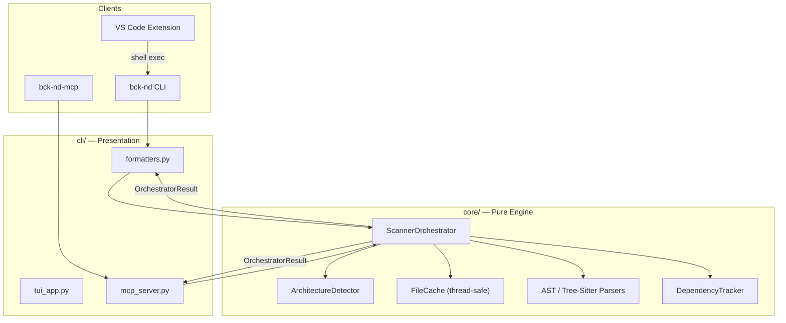

# Advanced Configuration

## 🚀 Version 2.0.0

Version 2.0.0 decouples the analysis engine from the terminal layer. Full release notes: [CHANGELOG.md](CHANGELOG.md#200).

### Architecture Overview



**Data flow:** Clients pass an `OrchestratorConfig` to `ScannerOrchestrator.run()`. The engine returns a serializable `OrchestratorResult` with diagrams, scan metrics, and `execution_warnings`. The `cli/` layer handles all terminal formatting (`rich`, `typer`); `core/` has zero terminal dependencies.

---

## 🤖 MCP Integration (Claude Desktop / Cursor)

Backend Helper includes a server compatible with the **Model Context Protocol (MCP)**. This allows any compatible AI client (like **Claude Desktop** or **Cursor**) to interact directly with your codebase using local reverse engineering and diagramming tools — without sending full files to the cloud or consuming valuable context tokens.

The AI calls local tools on demand to analyze architecture, generate diagrams, search for technical debt, or audit security.

### Run the MCP Server (Local Test)

After installing the package (`pip install bck-nd-hlpr` or `pip install -e .`), start the server with the packaged entry point:

```bash
bck-nd-mcp
```

> **Note:** The legacy root-level `mcp_server.py` shim and `python -m bck_nd_hlpr.mcp_server` path are deprecated. Always use `bck-nd-mcp`.

### Available MCP Tools (20)

| Tool | Purpose |
| --- | --- |
| `scan_project` | Full architectural scan |
| `get_project_tree` | ASCII directory tree |
| `get_uml_diagram` | UML class diagram (Mermaid) |
| `get_er_diagram` | Entity-Relationship diagram (Mermaid) |
| `get_routes_diagram` | API routes sequence diagram |
| `get_infra_diagram` | Docker / infrastructure map |
| `scan_todos` | Technical debt (TODO/FIXME) |
| `audit_security` | Hardcoded secrets & security risks |
| `analyze_impact` | Dependency heatmap / blast radius |
| `generate_ai_context` | LLM-optimized context dump |
| `generate_html_docs` | Static HTML documentation portal |
| `render_flow_diagram` | Custom flow from string description |
| `explain_architecture_with_ai` | AI-powered architectural review |
| `get_traceability_diagram` | Route-to-DB traceability map |
| `init_ci` | Inject GitHub Actions workflow |
| `get_project_health` | 0–100 health scorecard |
| `get_guided_onboarding` | Tier-ordered reading sequence |
| `export_data_dictionary` | Schema export (JSON/CSV) |
| `get_impact_radius` | Transitive impact of a file change |
| `get_api_contract_map` | API routes ↔ database columns |

### Configure Clients

#### 1. Claude Desktop

Add the following block to your `claude_desktop_config.json`:

- **Windows:** `%APPDATA%\Claude\claude_desktop_config.json`
- **Mac/Linux:** `~/Library/Application Support/Claude/claude_desktop_config.json`

```json
{
  "mcpServers": {
    "backend-helper": {
      "command": "bck-nd-mcp",
      "env": {
        "OPENAI_API_KEY": "your-optional-api-key",
        "ANTHROPIC_API_KEY": "your-optional-api-key"
      }
    }
  }
}
```

#### 2. Cursor

1. Go to **Cursor Settings** → **Features** → **MCP**.
2. Click **+ Add New MCP Server**.
3. Configure:
   - **Name:** `backend-helper`
   - **Type:** `command`
   - **Command:** `bck-nd-mcp`
4. Save and click **Refresh**. You now have 20 local architecture tools available to your AI assistant.

### Troubleshooting MCP

**`bck-nd-mcp` not found in PATH**

Reinstall and verify:

```bash
pip install -U bck-nd-hlpr
bck-nd-mcp --help
```

**Fallback for virtualenv / PATH issues**

If the global executable is unavailable, point the client to the active Python environment:

```json
{
  "mcpServers": {
    "backend-helper": {
      "command": "python",
      "args": ["-m", "bck_nd_hlpr.cli.mcp_server"],
      "env": {
        "OPENAI_API_KEY": "your-optional-api-key",
        "ANTHROPIC_API_KEY": "your-optional-api-key"
      }
    }
  }
}
```

---

## 💾 Exporting Diagrams to Files

Save any diagram or report with `-o` / `--output`. ANSI color codes are stripped automatically.

```bash
# Clean Mermaid file for Obsidian, Notion, or CI/CD
bck-nd scan . --er -o schema.mmd

# Plain-text technical debt report
bck-nd scan . --todo -o debt-report.txt
```

---

## ⚙️ Custom Architecture Detection

Override folder heuristics in `pyproject.toml`:

```toml
[tool.bck-nd]
controllers = ["handlers", "views"]
models = ["entities", "schemas"]
services = ["logic", "usecases"]
```

---

## 🔌 Using the Core as a Library

The decoupled `core/` engine can be imported without any terminal dependencies:

```python
from bck_nd_hlpr.core.orchestrator import ScannerOrchestrator, OrchestratorConfig

config = OrchestratorConfig(path=".", depth=3, uml=True, er=True)
result = ScannerOrchestrator.run(config)

print(result.uml)
print(result.er)
print(result.execution_warnings)  # Non-fatal parser errors
```

---

## ⚠️ Known Limitations

See the full limitations table in [README.md](README.md#️-known-limitations). Parser coverage varies by language and ORM — heuristics are best-effort, not compiler-grade analysis.
