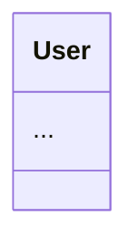
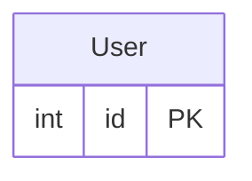

# 🛠️ Backend Helper (`bck-nd-hlpr`)

[](https://pepy.tech/projects/bck-nd-hlpr)
[](https://badge.fury.io/py/bck-nd-hlpr)
[](https://opensource.org/licenses/MIT)

### The Backend Helper: CLI Context & MCP Tooling for AI and Humans

`bck-nd-hlpr` is a lightweight Python CLI utility designed to bridge the gap between back-end codebases, human developers, and AI agents. It acts as a context provider — extracting structural architecture, tracking product requirements, generating visual diagrams (such as Mermaid.js charts), and facilitating Model Context Protocol (MCP) interactions.

---

## 🚦 Release Status

### v2.5.0 — Current Stable Release

v2.5.0 is the current stable release in this repository. It is prepared for release, while publication to PyPI remains pending explicit human authorization.

The release adds a local-first PRD Intelligence layer that keeps human-authored product intent separate from detailed requirements and the technical architecture discovered by the scanner:

- **Local product contract:** version-controlled `.bck-nd/product/*.md` documents use YAML front matter and the lifecycle states `DRAFT`, `REVIEW`, `APPROVED`, `SHIPPED`, and `ARCHIVED`.
- **Deterministic validation:** typed models, safe parsing, lifecycle-aware diagnostics, stable JSON output, linked requirement IDs, and monorepo scope through `applies_to`.
- **CLI workflow:** `bck-nd prd init`, `list`, `validate`, and `status`, with `--path` / `-p` for selecting a project root.
- **Trusted AI context:** a canonical `<product_context>` block appears before requirements and technical architecture, uses a shared deterministic budget, and can be excluded completely with `--no-prd`.
- **Requirements workflow:** `bck-nd req init`, `list`, `show`, `validate`, `status`, `discover`, and `locations` keep concise briefs separate from complete story detail and make nested collection boundaries visible.
- **Context controls:** `--max-product-chars` defaults to 6000 characters and `--max-requirements-chars` to 12000; both have a public minimum of 256. `--no-prd` and `--no-req` are independent.
- **Read-only MCP:** `get_product_context` exposes the same canonical scoped representation without modifying product sources.
- **Backward compatibility:** repositories without `.bck-nd/product/` preserve their previous prompt behavior without empty product tags.
- **Context fidelity fixes:** `scan` and `prompt` share canonical polyglot UML/ER aggregation at equal path and depth. Diagram discovery loads root and nested `.gitignore` rules incrementally, prunes ignored directories before descent, and uses pathname-aware wildcards with Git-compatible trailing-space and character-class semantics. Incomplete, oversized, unreadable, or linked ignore policies block only their governed scope instead of applying a partial policy. `<core_files>` uses dependency impact plus architectural priorities, and Windows clipboard export preserves Unicode through UTF-16LE.
- **Local security boundaries:** project-contained paths, bounded safe YAML, strict deterministic serialization, verified product/requirements reads, and minimal atomic status updates with concurrent-modification detection. Project indexing, tree rendering, and final cached reads reject symlinks, junctions, reparse points, and non-regular entries before repository content reaches an AI context.
- **Unified credential hygiene:** one high-confidence credential registry drives both redaction and audit detection. Core files, requirements summaries, prompt output, security reports, JSON, and MCP responses replace detected credential values with `***REDACTED***` without modifying source files. This is output hygiene, not a secret manager.

PRD Intelligence structures and delivers decisions written by humans; it does not generate or approve product intent autonomously.

**Release verification:** 936 tests collected: **934 passed, 2 skipped** on Windows with Python 3.13.5. Both skips are the expected product-parser symlink cases denied by Windows with `WinError 1314`. The portal additionally passed real-browser checks for all four diagram types via local files and HTTP with external networking unavailable; historical sprint counts remain in their corresponding release notes.

**Runtime compatibility:** v2.5.0 requires Python `>=3.10`. Its declared support classifiers cover Python 3.10–3.13, and final local release verification ran on Windows with Python 3.13; newer Python versions can satisfy `Requires-Python` but are not yet part of this release's verified support matrix. Backend Helper uses the maintained official MCP SDK 1.x API through `mcp>=1.28.1,<2`, preventing fresh installations from resolving the incompatible MCP 2.x API. MCP SDK 2.x support requires an explicit later migration and is not claimed by this release.

### v2.4.3 — Previous Stable Release

v2.4.3 is the previous stable patch release, extending the Four Pillars and Requirements Intelligence layer with compiled-backend UML, polyglot monorepo detection, requirement status workflows, measurable AI context savings, machine-readable scans, and fully offline project documentation.

All changes listed below are implemented and verified by the full test suite.

#### Verified changes — Sprint 1

- **Added — Go UML:** extracts `.go` structs, typed fields, receiver methods, and interfaces through an optional Tree-sitter visitor plus a safe balanced-brace fallback.
- **Added — Rust UML:** extracts `.rs` structs, enums, impl methods, and traits with the same visitor/fallback safety model.
- **Added — Polyglot Monorepos:** detects distinct frameworks in common frontend/backend, client/server, apps, packages, web, and API layouts.
- **Changed — Framework routing:** Gin, Fiber, Go, Actix-web, Actix, Rocket, and Rust route directly to their compiled-language UML extractors.
- **Changed — ASG parity:** Go/Rust classes and interface semantics now flow into the Abstract Semantic Graph with language metadata.
- **Verified:** **272 tests passing** after the Sprint 1 integration.

#### Verified changes — Sprint 2

- **Added — Requirement status workflow:** `bck-nd req status <STORY_ID> <STATUS>` (alias `set-status`) updates JSON or Markdown stories using the accepted `TODO`, `IN_PROGRESS`, `TESTING`, `DONE`, and `BLOCKED` states.
- **Added — AI context metrics:** every `bck-nd prompt` export reports its estimated token count, generated context size, raw non-ignored source size, and context savings percentage.
- **Preserved — Requirement sources:** Markdown updates modify only the story status badge while retaining sections, formatting, line endings, and existing content; JSON is normalized to clean two-space indentation.
- **Verified:** **286 tests passing** after the Sprint 2 integration.

#### Verified changes — Sprint 3

- **Added — Machine-readable scans:** `bck-nd scan . --json` emits a consolidated CI-friendly payload with framework metadata, ASG, requirements, health, debt, and security findings; focused analysis flags emit their native report structures.
- **Added — Direct JSON files:** combine `--json` with `-o result.json` to write clean indented JSON without terminal banners or status text.
- **Changed — Standalone documentation:** `bck-nd docs` now generates a responsive, single-file dashboard with embedded offline SVG diagram previews and no font or Mermaid CDN dependency.
- **Added — Requirements portal:** generated documentation includes a safely escaped requirements section and navigation entry whenever `.bck-nd/requirements/` contains stories.
- **Verified:** **296 tests passing** after the final v2.4.3 sprint integration.

#### Verified maintenance fixes

- **Fixed — Antigravity auto-installation:** `bck-nd-mcp --install` now detects the renamed `antigravity-ide` launcher and registers Backend Helper in Antigravity's official shared MCP configuration.
- **Preserved — Existing MCP servers:** configuration updates retain GitHub MCP, Supabase, and unrelated servers, create a backup, and replace JSON atomically.
- **Fixed — Manual stdio shutdown:** interrupting a directly launched `bck-nd-mcp` exits cleanly without exposing cancellation tracebacks.
- **Changed — Current CLI help:** root, prompt, requirements, and MCP help now document JSON scans, clipboard context, requirements workflows, context metrics, and Antigravity installation.
- **Verified:** **320 tests passing** after the Antigravity and CLI-help compatibility maintenance.

### v2.4.2 — Earlier Stable Release

v2.4.2 completes the first stabilization pass over the Four Pillars and Requirements Intelligence layer:

- **Clipboard-ready AI context:** `bck-nd prompt . --copy` / `-c` exports directly to the system clipboard without a Python dependency.
- **Requirements scaffolding:** `bck-nd req init <STORY_ID>` creates Markdown or JSON story templates, while the standard scan includes a requirements summary.
- **Unified project metadata:** generated cache state lives in `.bck-nd/cache/`; versionable specifications remain in `.bck-nd/requirements/`.
- **Stronger TypeScript support:** Next.js and React `interface` and `type` declarations are included in UML/ER extraction.
- **Safer UML output:** real components whose names contain `Empty` are no longer mistaken for empty placeholder diagrams.
- **Canonical documentation:** advanced MCP and requirements documentation now lives in this README.
- **Verified quality:** **248 tests passing** on the v2.4.2 release preparation run.

See [CHANGELOG.md](CHANGELOG.md) for the complete release history.

## 🧭 Documentation Map

- [Quick Start](#-quick-start) — install the CLI and run the main workflows.
- [Key Features](#-key-features) — capabilities grouped by purpose.
- [Four Pillars Architecture](#-the-four-pillars-architecture) — cache, providers, ASG, and scoped debt.
- [Product & PRD Intelligence](#-product--prd-intelligence) — capture, validate, scope, and deliver product intent.
- [Requirements Intelligence](#-context--requirements-intelligence-layer) — create, list, discover, and export user stories.
- [Command Manual](#-command-manual) — detailed CLI flags and examples.
- [MCP Integration](#-mcp-integration-claude-desktop--cursor--antigravity) — connect AI clients.
- [Advanced Configuration](#advanced-configuration) — client configuration and requirement schemas.

---

## ⚡ Quick Start

Until v2.5.0 receives explicit publication authorization, install it from this source checkout or from its locally built wheel. As checked against the public PyPI API on 2026-09-07, PyPI still serves v2.4.3 and has no v2.5.0 release; the command below therefore does not install this pending release yet.

```bash
pip install -U bck-nd-hlpr

# Confirm the installed release
bck-nd --version

# Scan architecture and generate diagrams
bck-nd scan .

# Emit the complete scan as JSON for CI/CD
bck-nd scan . --json

# Export LLM-ready context: product intent + requirements + architecture + core files
bck-nd prompt .

# Exclude local PRD product context when it is sensitive or unnecessary
# This does not modify the source PRD
bck-nd prompt . --no-prd

# Strictly technical context excludes both independent business layers
bck-nd prompt . --no-prd --no-req

# Create and validate a local product contract
bck-nd prd init PRD-AUTH
bck-nd prd validate PRD-AUTH

# Or copy that context directly into the system clipboard
bck-nd prompt . --copy

# Scaffold, browse, validate, and discover project requirements
bck-nd req init US-001
bck-nd req list
bck-nd req show US-001
bck-nd req validate
bck-nd req status US-001 IN_PROGRESS
bck-nd req discover US-001
bck-nd req locations

# Quote project roots containing spaces
bck-nd req list "C:\projects\customer portal"
bck-nd req init US-002 --path "C:\projects\customer portal"

# Connect to Claude Desktop / Cursor / Antigravity IDE
bck-nd-mcp --install --allowed-root /absolute/path/to/project
```

## 🧭 When to Use What

| Entry point | Best for |
| --- | --- |
| `bck-nd scan` | Inspect the current project and produce human-readable or machine-readable technical reports and views |
| `bck-nd prompt` | Package product intent, Requirements, and discovered architecture as context for an AI agent |
| `bck-nd prd` | Local product intent, lifecycle validation, and scoped AI context |
| `bck-nd req` | Tracking user stories, acceptance criteria, and stakeholder discovery |
| `bck-nd-mcp` | Persistent MCP tools inside Claude Desktop, Cursor, or Antigravity |
| `bck-nd explore` | Full-screen TUI to browse and visualize the codebase |
| `bck-nd docs` / `init-ci` | Static HTML portal and GitHub Pages automation |
| VS Code Extension | In-editor diagrams, audits, and clipboard context — see [README-EXTENSION.md](vscode-extension/README-EXTENSION.md) |

## ⚡ Key Features

### Detection & Architecture

- 🔍 **Auto-Detection**: Flask, FastAPI, Django, Next.js, Express.js, NestJS, Gin, Fiber, Actix-web, Rocket, and more
- 🧭 **Polyglot Monorepos**: Detects distinct frontend/backend frameworks and aggregates project features across common workspace layouts
- 🧩 **Autonomous Providers**: Laravel, FastAPI, Django, Spring Boot, EF Core, and Node.js each ship as self-contained semantic providers
- 🏭 **Architecture Recognition**: MVC, Microservices, Layered Architecture patterns
- 🌍 **Polyglot Ready**: C#, Python, JS/TS, Java, PHP, Go, Rust, Docker, Terraform, Prisma, SQL migrations
- ⚙️ **Flexible Config**: Customize detection via `pyproject.toml`
- 📄 **Hierarchical `.gitignore` Support**: Applies root and nested rules relative to their directories, including deterministic `!` negation, before files reach scans or context dumps
- 📱 **Expo/React Native Detection**: Appropriate diagramming for mobile projects

### Speed & Structure

- ⚡ **Incremental Delta Cache**: `.bck-nd/cache/delta.json` stores verified signatures after cache state is successfully saved; constructing the manager alone creates nothing. Use `--no-cache` for a clean run
- 🌐 **Abstract Semantic Graph (ASG)**: Normalized in-memory architecture graph, queryable by AI agents via MCP

### Diagrams & Visualization

- **Smart Diagrams**: Controllers, Models, Services, Routes — Unicode or Mermaid output
- 🧱 **Compiled Backend UML**: Go structs/interfaces/receiver methods and Rust structs/enums/traits/impl methods
- 🎨 **Visual & Mermaid**: Terminal diagrams or copy-paste Mermaid code
- 🚀 **Auto-Documentation (CI/CD)**: One-command GitHub Actions setup for living docs (`init-ci`)
- 📴 **Offline Documentation Portal**: Responsive single-file dashboard with embedded SVG fallbacks and requirements
- 📊 **Jupyter Notebook Lineage** (`--datascience`): Data pipeline flowcharts from `.ipynb` files
- 🔧 **Machine-Readable Scans** (`scan --json`): Stable JSON reports for CI/CD pipelines and scripts

### AI & Context

- 🧠 **AI Context Dump** (`bck-nd prompt`): Single LLM-optimized `.txt` with applicable product intent + requirements + project tree + UML + ER + core files
- 🧭 **PRD Context**: Canonical budgeted `<product_context>` with source provenance, lifecycle trust, scope selection, and safe diagnostics
- 📋 **Requirements Context**: `<requirements_context>` block with user stories and business rules injected into `ai_context.txt`
- 🎯 **Focused Export** (`--uml`, `--er`, `--tree`): Product- and Requirements-aware context plus the requested technical sections; use `--no-prd --no-req` together for strictly technical output
- 📋 **Clipboard Export** (`--copy`, `-c`): Copy full or focused context directly with native OS clipboard tools
- 📊 **Context Metrics**: Reports estimated tokens, context size, raw source size, and percentage saved on every prompt export
- 🤖 **BYO-Key AI Analysis**: OpenAI, Anthropic, Gemini, OpenRouter, or local Ollama — no middleware
- ⚙️ **`--max-core-files N`**: Limit core files exported by `bck-nd prompt`

### Requirements Intelligence

- 🧱 **`bck-nd req init`**: Scaffold a standard Markdown or JSON user story under `.bck-nd/requirements/`
- 📖 **`bck-nd req list`**: Concise briefs for the selected collection, with ID, status, title, `Como` / `Quiero` / `Para`, and criteria/rule counts; use `req show` for complete story detail
- ✨ **`bck-nd req status`**: Move Markdown or JSON stories through `TODO`, `IN_PROGRESS`, `TESTING`, `DONE`, or `BLOCKED`
- 🕵️ **`bck-nd req discover`**: Auto-generates a Stakeholder Interview Guide per story
- 🧾 **Standard Scan Summary**: `bck-nd scan .` includes discovered requirements alongside architecture output
- 🔌 **`get_requirements_summary`**: MCP tool exposing live requirements state to Claude Desktop, Cursor, and Antigravity

### Quality, Security & Onboarding

- 🛡️ **Dependency-Free Core**: No PyTorch, No Transformers. Installs in <3 seconds
- 🪟 **OS-Safe Scanning**: Ignores `venv`, `node_modules`, and restricted system paths
- 🎓 **Guided Onboarding** (`--teach`): Tier-ordered learning curriculum via dependency heatmaps
- 🛡️ **QA Impact Radius** (`--impact-radius <file>`): Transitive reverse-dependency blast radius
- 🔌 **API Contract Map** (`--contract`): Match API endpoints to ORM tables and columns
- ❤️ **Project Health Score** (`--health`): 0–100 score with letter grade (A–F)
- 🧹 **Scoped Debt Categories**: `TODO(audit)`, `FIXME(security)`, `HACK(perf)`, and more

---

## 🏛️ The Four Pillars Architecture

The internal engine is organized around four pillars that work together: the cache accelerates providers, providers feed the graph, and the graph feeds both diagrams and AI.

### 1. ⚡ Incremental Delta Cache

Cached scans maintain verified project fingerprints in memory and persist them to `.bck-nd/cache/delta.json` only when cache state is successfully saved. Merely constructing `DeltaCacheManager` does not create `.bck-nd/` or the cache file. On a later run, matching signatures can avoid redundant work.

```bash
# Normal scan — uses the cache automatically
bck-nd scan .

# Force a full rescan, ignoring the cache
bck-nd scan . --no-cache
```

> `.bck-nd/cache/` is generated project-local state and should be ignored by Git; `.bck-nd/requirements/` remains versionable.

### 2. 🧩 Autonomous Provider Pattern

Instead of one monolithic detector, each supported framework — **Laravel, FastAPI, Django, Spring Boot, EF Core, and Node.js** — is implemented as a self-contained semantic provider. Each provider owns its own detection heuristics, UML extraction, and ER extraction, so framework support can be added, tested, and fixed in isolation without touching the rest of the engine.

### 3. 🌐 Abstract Semantic Graph (ASG)

All providers normalize their output into one **Abstract Semantic Graph** — an in-memory architecture IR that represents controllers, models, services, routes, and their relationships in a framework-agnostic shape. The ASG is what powers diagrams and reports, and it's also queryable directly by AI agents inside Claude Desktop, Cursor, or Antigravity via the MCP tool:

```
get_asg_graph
```

### 4. 🧹 Scoped Technical Debt Hunter

The technical debt scanner now understands **scope tags**, letting teams triage debt by category instead of treating every comment the same:

| Tag | Meaning |
| --- | --- |
| `TODO(audit)` | Needs a follow-up review or decision |
| `FIXME(security)` | Known security-relevant issue |
| `HACK(perf)` | Deliberate performance shortcut |

```bash
bck-nd scan . --todo
```

---

## 🧭 Product & PRD Intelligence

A PRD records **why** a product or release exists, who it serves, its goals, scope, boundaries, success measures, risks, and unresolved decisions. Requirements describe **what behavior** must be delivered through user stories, business rules, and acceptance criteria. The scanner and ASG describe **what the codebase currently is**. Backend Helper combines these three layers as explicit context; it does not infer or invent missing product intent.

### Local document contract

Editable PRDs are UTF-8 Markdown files with YAML front matter under `.bck-nd/product/`. The metadata identifies the document, lifecycle state, applicable project paths, and linked requirement IDs. The required narrative remains human-authored.

```yaml
---
schema_version: 1
id: PRD-AUTH
title: Authentication release
status: DRAFT
applies_to:
  - apps/api
requirement_ids:
  - US-001
---
```

Supported lifecycle states are `DRAFT`, `REVIEW`, `APPROVED`, `SHIPPED`, and `ARCHIVED`. Validation is lifecycle-aware: incomplete material can be reported while drafting, but blocking errors prevent transitions to `REVIEW`, `APPROVED`, or `SHIPPED`. Open questions are warnings in `DRAFT` and `REVIEW`, and block `APPROVED` and `SHIPPED`.

### User workflow

```console
# Current project
bck-nd prd init
bck-nd prd init PRD-AUTH
bck-nd prd list
bck-nd prd validate
bck-nd prd validate PRD-AUTH
bck-nd prd validate --json
bck-nd prd status PRD-AUTH REVIEW

# Another project root: --path / -p is available on every prd command
bck-nd prd list --path ./my-project
bck-nd prd validate PRD-AUTH --path ./my-project --json

# Product-aware AI context
bck-nd prompt .
bck-nd prompt . --max-product-chars 6000
bck-nd prompt . --no-prd
```

`bck-nd prd init` without an ID creates `.bck-nd/product/PRD.md`. `prd validate --json` emits deterministic diagnostics suitable for scripts and CI. `prd status` makes a minimal atomic metadata edit after validating the requested transition.

### Scope, budget, and trust

- `applies_to: [.]` targets the full project. Component-aware paths such as `frontend` or `apps/api` select PRDs for overlapping monorepo scopes without unsafe string-prefix matching.
- All applicable active PRDs share one deterministic character budget. `--max-product-chars` defaults to 6000; values below 256 are rejected.
- `<product_context>` is emitted before `<requirements_context>`, the project tree, and architecture blocks.
- `approved=true` is possible only for an `APPROVED` or `SHIPPED` document whose validation is `VALID`.
- An invalid document retains its declared status as provenance, but is never presented as approved and contributes no trusted narrative.
- An applicable `DRAFT` may appear, always with a visible non-approved trust notice.
- `--no-prd` prevents loading and including product context, including in focused prompt modes.
- Exposed paths are project-relative or the sentinel `<outside-project>`.
- High-confidence credential shapes in PRD narrative are replaced with `***REDACTED***` before budgeting and serialization. This is output hygiene, not a secret manager or enterprise governance control.
- Every payload includes a compact `diagnostic_summary`; an applicable error code remains visible even when the 256-character minimum budget cannot include the full diagnostic.
- PRD sources are limited to 1 MiB. YAML front matter is limited to 128 KiB, 64 levels, and 10,000 composed nodes before Python objects are constructed.
- When no product directory exists, Backend Helper emits no empty product block and preserves the previous context behavior.

PRD content remains repository data, not instructions to Backend Helper itself. The feature is local and deterministic: it does not call an AI model, cloud service, Jira, or Confluence, and it does not add PRD nodes to the ASG or the offline HTML portal.

---

## 📋 Context & Requirements Intelligence Layer

Architecture tells you *how* a system is built. The Requirements Intelligence Layer tells you *why* — turning user stories and business rules into first-class, AI-queryable context alongside your code.

### `bck-nd req init <story_id>`

Creates a versionable requirement template under `.bck-nd/requirements/` so every story begins with the same structure:

```bash
# Markdown template (default)
bck-nd req init US-042

# JSON template
bck-nd req init US-043 --format json
```

Templates include Role, Want, Benefit, Business Rules, Acceptance Criteria, Required Data, Validations, Exceptions, and Open Questions.

### `bck-nd req list`

Renders concise, actionable story briefs for the explicitly selected collection. Every brief includes the story ID, status, title, `Como` / `Quiero` / `Para` summary, and acceptance-criteria/business-rule counts. Complete sections remain available through `req show`:

```bash
bck-nd req list
bck-nd req show US-042
bck-nd req validate
```

The terminal groups those fields into `Story` and `Story Brief`; it does not print full rules or criteria in the list view. Run `bck-nd req show <story_id> [project_path]` for Role, Want, Benefit, Business Rules, Acceptance Criteria, Required Data, Validations, Exceptions, and Open Questions.

### Collection scope and locations

Requirements live under `.bck-nd/requirements/` in the selected project root. `bck-nd req locations [project_path]` discovers root and descendant collections, conflicts, and ignored locations without merging them. Select a nested collection explicitly by passing its own project root to `list`, `show`, `validate`, `discover`, `scan`, or `prompt`.

```bash
bck-nd req locations "C:\projects\customer portal"
bck-nd req list "C:\projects\customer portal\apps\api"
bck-nd req show US-042 "C:\projects\customer portal\apps\api"
```

### `bck-nd req status <story_id> <new_status>`

Updates the source requirement file in place. Status names are case-insensitive, and `set-status` is available as an alias:

```bash
bck-nd req status US-042 IN_PROGRESS
bck-nd req set-status US-042 DONE
```

JSON stories may store `status` inside `story` or at the document root. Markdown stories use `# US-042 [IN_PROGRESS] - Title`; all sections below that header remain untouched.

Status writers are serialized with the persistent `.bck-nd/requirements/.bck-nd-status.lock`, then re-read and atomically replaced under that lock. The lock coordinates cooperative Backend Helper writers, while final revalidation detects observable changes made before replacement. A minimal interval necessarily remains between that last check and the atomic replacement syscall, so this is not protection against malicious, privileged, or non-cooperating processes with the same filesystem permissions. It is also not an operating-system sandbox, RBAC system, or secret manager.

### `bck-nd req discover [story_id]`

Generates a **Stakeholder Interview Guide** — a structured set of discovery questions you can take straight into a requirements-gathering session:

```bash
bck-nd req discover US-042
```

**Guide sections:**

- **Mandatory Data** — the inputs/fields the feature absolutely needs
- **Business Rules** — constraints, validations, and edge-case logic
- **Exceptions** — error states and how they should be handled
- **Acceptance Criteria** — how you'll know the story is complete

### AI Context Injection

Running `bck-nd prompt .` now injects a `<requirements_context>` XML block directly into `ai_context.txt`, so any LLM you paste it into immediately understands not just your code, but the requirements behind it:

```xml
<requirements_context>
  <story id="US-042" status="IN_PROGRESS">
    <title>Allow refunds on partial shipments</title>
    <acceptance_criteria>...</acceptance_criteria>
    <business_rules>...</business_rules>
  </story>
</requirements_context>
```

### MCP Tool: `get_requirements_summary`

The same requirements data is available live inside Claude Desktop, Cursor, or Antigravity via the `get_requirements_summary` MCP tool — no need to re-export or re-paste context after every change.

### Standard Scan Integration

`bck-nd scan .` automatically includes the requirements summary when specifications are present, keeping architecture and product intent together in the normal project overview.

---

## 🚀 Release History

### v2.5.0 — PRD Intelligence

Added the local-first PRD domain, lifecycle-aware CLI validation, deterministic JSON diagnostics, canonical product context for prompts and MCP, monorepo applicability, trust-aware rendering, and release hardening. This release is prepared in the repository; PyPI publication remains pending.

### v2.4.3 — Compiled UML, Polyglot Detection & Automation

Added Go and Rust UML extraction, polyglot monorepo detection, requirement status transitions, AI context metrics, machine-readable JSON scans, and a standalone offline documentation portal. See the [previous stable release summary](#v243--previous-stable-release) or [CHANGELOG.md](CHANGELOG.md).

### v2.4.2 — Stabilization & Workflow Integration

Clipboard export, requirement scaffolding, standard-scan requirement summaries, unified `.bck-nd/` storage, stronger TypeScript/Next.js extraction, and UML empty-state fixes. See the [previous stable release summary](#v242--previous-stable-release) or [CHANGELOG.md](CHANGELOG.md).

### v2.4.1 — Four Pillars & Requirements Foundation

Introduced the Incremental Delta Cache, Autonomous Provider Pattern, Abstract Semantic Graph, Scoped Technical Debt Hunter, initial Requirements Intelligence layer, Markdown story parsing, and the CLI version flag.

Full details in [CHANGELOG.md](CHANGELOG.md).

### v2.0.0 — Engine Rebuild

Major architecture release: decoupled `core/` engine, concurrent `ScannerOrchestrator`, thread-safe file cache, lazy parser loading, fault-tolerant scans, and direct `.mmd` export. Full details are in [CHANGELOG.md](CHANGELOG.md); MCP clients and requirements schemas are covered in [Advanced Configuration](#advanced-configuration).

### 🗄️ ORM Parser Support Status

| ORM                                  | Parser Type   | Coverage / Status  |
| :----------------------------------- | :------------ | :----------------- |
| **SQLAlchemy** (Python)        | Tree-Sitter   | Full AST Extractor |
| **Django ORM** (Python)        | Tree-Sitter   | Full AST Extractor |
| **Entity Framework Core** (C#) | Tree-Sitter   | Full AST Extractor |
| **Prisma** (Schema)            | Regex / Lexer | Schema Matcher     |
| **TypeORM** (JS/TS)            | Regex / Lexer | Structural Matcher |
| **Sequelize** (JS/TS)          | Regex / Lexer | Structural Matcher |

---

## 📦 Installation

Backend Helper v2.5.0 requires Python `>=3.10`. Its declared support classifiers cover Python 3.10–3.13, and the final local release verification used Windows with Python 3.13. Newer Python versions can satisfy `Requires-Python`, but they are not yet part of v2.5.0's verified support matrix. The MCP server targets the official MCP SDK 1.x line through `mcp>=1.28.1,<2`; this keeps new installations on the compatible `FastMCP` API until a separately tested MCP 2.x migration is completed.

```bash
# From PyPI
pip install bck-nd-hlpr

# From source
cd bck-nd-hlpr
pip install .

# Development mode
pip install -e .

# Verify installation and version
bck-nd --version
# or
bck-nd -v

bck-nd --help

# Optional: Set your preferred AI Provider key
# set OPENAI_API_KEY=sk-... (Windows)
# export OPENAI_API_KEY=sk-... (Mac/Linux)
```

---

### 🌐 `docs` - Static HTML Portal Generation

Automatically generates a complete, static HTML documentation portal for your project. Perfect for CI/CD and GitHub Pages.

#### **Usage**

```bash
# Generate docs in the current directory (output folder: 'docs')
bck-nd docs . --output docs
```

**What you get in `docs/index.html`:**

- **Infrastructure Map:** Visual representation of `docker-compose.yml`.
- **API Routes:** Sequence diagrams of HTTP endpoints.
- **UML Class Diagram:** Auto-generated class hierarchy with associations and dependencies.
- **Entity-Relationship:** E-R diagrams for ORM models (Entity Framework, SQLAlchemy, Django).
- **Technical Debt:** Actionable table of TODOs and FIXMEs, including scoped tags such as `TODO(audit)` and `FIXME(security)`.
- **Requirements:** User stories, statuses, acceptance-criteria counts, and business-rule counts when specifications exist.
- **Offline diagrams:** The single HTML embeds Mermaid **11.17.2** and its license, rendering real UML, ER, infrastructure and sequence diagrams without a CDN or external fonts. The renderer adds about **953 KiB compressed** to the Python package and about **3.4 MiB** to each HTML portal; it adds no Python/Node/browser runtime dependency to the CLI. Opening the portal requires a JavaScript-enabled browser, including for `file://`. If scripts are disabled or a diagram is invalid, an explicit message accompanies the complete source; invalid edits preserve the last valid drawing.

The embedded renderer uses strict Mermaid security settings. The portal blocks external resource requests and fits large diagrams into scrollable panes; Fit, zoom and 100% controls expose the overview or readable detail. Diagrams are drawn in the browser, not pre-rendered SVGs available without JavaScript.

Maintainers can run the optional real-browser regression with Playwright available in their development environment: `node tests/browser/check_docs.cjs /path/to/generated/index.html /path/to/screenshots`. Set `BCK_ND_BROWSER_CHANNEL=msedge` (or another installed Playwright-supported channel) when necessary. It checks actual diagram geometry under `file://` and HTTP, edits while offline, invalid-source recovery, theme redraw, and the JavaScript-disabled fallback. Playwright is not a package/runtime dependency.

---

### 🧠 `prompt` - AI Context Dump

Generates a **single, LLM-optimized `.txt` file** with XML-like tags that you can copy-paste directly into ChatGPT, Claude, or any AI to give it instant, complete understanding of your project — architecture *and* requirements.

No more manually explaining your codebase structure — one command, one file, instant AI context.

#### **Full Mode (Default)**

```bash
# Generate ai_context.txt in the current directory
bck-nd prompt .

# Custom output file
bck-nd prompt /my/project -o context.txt

# Cap recursion when an unlimited prompt scan is unnecessary
bck-nd prompt . --depth 6

# Copy the generated context directly to the system clipboard
bck-nd prompt . --copy
```

Every full or focused export ends with a sizing footer such as:

```text
📊 AI Context: ~8,420 tokens (28.8 KB) | ⚡ 91.4% context savings vs raw codebase (334.9 KB)
```

Token counts use a lightweight code/XML estimate of approximately 3.5 characters per token. Raw size includes non-ignored source files in the selected scan depth, so generated files, dependencies, cache content, and `.gitignore` matches do not inflate the comparison.

Prompt depth is unlimited by default. `--output -` writes the context block to standard output; `-o/--output <file>` writes it to a file, and `--copy` copies the same generated context with the platform clipboard command. Product and Requirements have separate budgets: `--max-product-chars` defaults to 6000 and `--max-requirements-chars` defaults to 12000; each rejects values below 256.

#### **Focused Mode (`--uml`, `--er`, `--tree`)**

Focused exports include applicable Product and Requirements context plus the requested technical sections by default. `--no-prd` removes Product and `--no-req` removes Requirements; use both together when you need strictly technical output. Product validation may still resolve linked requirement IDs unless Product itself is disabled, so neither switch should be described as a general guarantee that all requirement sources are unread.

| Flags used          | Default output file          |
| ------------------- | ----------------------------- |
| `--uml`             | `ai_context_uml.txt`         |
| `--er`              | `ai_context_er.txt`          |
| `--tree`            | `ai_context_tree.txt`        |
| `--uml --er`        | `ai_context_diagrams.txt`    |
| `--uml --er --tree` | `ai_context_diagrams.txt`    |
| *(no flags)*        | `ai_context.txt`             |

```bash
# Product + Requirements context with UML
bck-nd prompt . --uml

# Product + Requirements context with ER
bck-nd prompt . --er

# Product + Requirements context with project tree
bck-nd prompt . --tree

# UML only, with both business-context layers disabled
bck-nd prompt . --uml --no-prd --no-req

# Combine: UML + ER diagrams
bck-nd prompt . --uml --er

# Custom output with focused flag
bck-nd prompt . --uml -o my_diagrams.txt
```

#### **What the full file contains**

| XML Tag                    | Contents                                                        |
| --------------------------- | ----------------------------------------------------------------- |
| `<product_context>`       | Applicable PRD provenance, lifecycle trust, linked requirement IDs, and budgeted product narrative |
| `<requirements_context>`  | User stories, status, acceptance criteria, and business rules    |
| `<project_tree>`          | Clean ASCII directory tree (no venv/node_modules)                |
| `<architecture_uml>`      | UML Class Diagram in Mermaid format                               |
| `<architecture_er>`       | Entity-Relationship Diagram in Mermaid format                     |
| `<core_files>`            | Prioritized architectural files (default limit: 5 backend, 8 mobile) |

#### **How to use it**

1. Run `bck-nd prompt .` in your project root
2. Open `ai_context.txt`
3. Select All → Copy
4. Paste into ChatGPT / Claude as the first message
5. Start asking questions about your codebase — and its requirements — immediately!

#### **Example output structure**

````xml
<!-- bck-nd-hlpr Context Dump -->
<!-- Paste this file into ChatGPT / Claude for instant AI context -->

<product_context schema_version="1">
{"truncated":false,"documents":[{"id":"PRD-AUTH","status":"APPROVED","approved":true,"validation":"VALID"}],"diagnostics":[]}
</product_context>

<requirements_context>
<story id="US-042" status="IN_PROGRESS">
  <title>Allow refunds on partial shipments</title>
  <acceptance_criteria>...</acceptance_criteria>
  <business_rules>...</business_rules>
</story>
</requirements_context>

<project_tree>
my-project/
+-- src/
|   +-- main.py
|   +-- models.py
\-- tests/
</project_tree>

<architecture_uml>


</architecture_uml>

<architecture_er>



</architecture_er>

<core_files>
<file path="src/main.py">

```python
# ... file content ...
```

</file>
</core_files>
````

---

### 💬 `chat` - Interactive Architecture and Business Context

`bck-nd chat [path]` loads the detected architecture plus applicable Product and Requirements context before opening the configured AI provider. The exclusions are independent: `--no-prd` removes Product context, `--no-req` removes Requirements context and collection-scope discovery, and both are required for a strictly technical chat. Product validation can resolve linked requirement IDs while Product remains enabled.

```bash
bck-nd chat .
bck-nd chat . --style hacker
bck-nd chat . --provider ollama
bck-nd chat . --no-prd --no-req
```

Chat requires a configured provider or local Ollama. It does not run during ordinary `scan` or `prompt` commands.

---

### 📋 `req` - Requirements Intelligence Layer

Track user stories and generate stakeholder discovery guides straight from the terminal — and feed the same data to your AI tools automatically.

#### **`req init <story_id>`**

```bash
# Markdown template (default)
bck-nd req init US-001

# JSON template
bck-nd req init US-002 --format json
```

Creates `.bck-nd/requirements/<STORY_ID>.md` or `.json` with the standard story, rules, acceptance criteria, data, validation, exception, and open-question sections.

#### **`req list`**

```bash
bck-nd req list
```

Renders concise story briefs with **Story ID**, **Title**, a color-coded **Status** badge (`TODO`, `IN_PROGRESS`, `TESTING`, `DONE`, `BLOCKED`), the **Como / Quiero / Para** summary, and counts for **Acceptance Criteria** and **Business Rules**. Use `show` for the complete story.

#### **`req show <story_id> [project_path]`**

```bash
bck-nd req show US-001
bck-nd req show US-001 "C:\projects\customer portal"
```

Displays Role, Want, Benefit, Business Rules, Acceptance Criteria, Required Data, Validations, Exceptions, and Open Questions for one story.

#### **`req validate [project_path]`**

```bash
bck-nd req validate
bck-nd req validate "C:\projects\customer portal"
```

Validates the selected collection and reports its story, criteria, rule, and open-question counts. A missing, rejected, or empty collection returns a non-zero status.

#### **`req status <story_id> <status>`**

```bash
bck-nd req status US-001 IN_PROGRESS
bck-nd req status US-001 DONE --path "C:\projects\customer portal"
```

Updates Markdown or JSON using one of `TODO`, `IN_PROGRESS`, `TESTING`, `DONE`, or `BLOCKED`; `set-status` is an alias.

#### **`req discover [story_id]`**

```bash
bck-nd req discover US-042
```

Generates a **Stakeholder Interview Guide** for the given story, with discovery questions grouped into **Mandatory Data**, **Business Rules**, **Exceptions**, and **Acceptance Criteria** — ready to use in your next requirements session.

#### **`req locations [project_path]`**

```bash
bck-nd req locations .
bck-nd req locations "C:\projects\customer portal"
```

Discovers root and descendant `.bck-nd/requirements/` collections, reports their relative roots and conflicting IDs, and keeps every collection independent. Commands operate only on the explicitly selected project root: nested collections are never merged automatically. To inspect one, pass its root directly, for example `bck-nd req list "C:\projects\customer portal\apps\api"`.

#### **How it connects to the rest of the toolchain**

- Every `bck-nd prompt .` run injects a `<requirements_context>` block built from the same data (see the [Requirements Intelligence Layer](#-context--requirements-intelligence-layer) section above).
- The `get_requirements_summary` MCP tool exposes this data live to Claude Desktop, Cursor, and Antigravity.
- `bck-nd scan .` prints compact Requirements metrics, while `bck-nd scan . --req` displays story briefs. Technical views such as `--uml --er` may be combined.

> See [Advanced Configuration](#advanced-configuration) for the requirements file format and project setup.

---

### 🚀 `init-ci` - GitHub Actions Automation

Set up "Living Documentation" in seconds. This command injects a ready-to-use GitHub Action into your repository.

#### **Usage**

```bash
bck-nd init-ci
```

**What it does:**

- Creates `.github/workflows/bck-nd-docs.yml`.
- Adds `.bck-nd/cache/` to `.gitignore` while keeping `.bck-nd/requirements/` versionable.
- Configures an automatic trigger on `push` to the `main` branch.
- Installs `bck-nd-hlpr` in the CI runner.
- Generates the full HTML portal (UML, ER, Infra, Routes).
- Deploys the result automatically to **GitHub Pages**.

---

### 🕵️ `scan` - Automatic Architecture Detection

Automatically scans your project, detects the framework and architecture, and generates intelligent diagrams. Repeat scans are accelerated by the [Incremental Delta Cache](#1--incremental-delta-cache).

#### **Basic Usage**

```bash
# Scan current directory (default depth: 3)
bck-nd scan .

# Scan specific directory
bck-nd scan src

# Custom depth
bck-nd scan . --depth 5
```

#### **Modes**

Views are combinable. For example, `bck-nd scan . --uml --er` renders both canonical polyglot diagrams using the same UML and ER aggregators used by `bck-nd prompt` when path and depth are equal. The default scan keeps its depth of 3; prompt remains unlimited unless `--depth` is supplied.

##### 1. **Full Architecture Overview (Default)**

```bash
bck-nd scan .
```

**Output:**

- Framework detection (Flask, FastAPI, Django, etc.)
- Architecture type (MVC, Microservices, etc.)
- Features (Docker, Auth, Database, etc.)
- Compact Requirements metrics when a selected collection exists
- **Infra Map:** Docker Compose services
- **API Routes:** Endpoints sequence diagram
- **UML & ER:** Class and Entity-Relationship Mermaid diagrams
- **TODOs:** Technical Debt Report

##### 2. **Mermaid Export**

```bash
bck-nd scan . --format mermaid
```

**Output:**

- Generates `graph TD` code ready to copy-paste into Notion, GitHub, or Obsidian.
- **Also shows** the specific visual diagram in the terminal for instant preview.
- Perfect for documentation and presentations.

##### 3. **UML Class Diagram**

```bash
bck-nd scan . --uml
```

- Generates `classDiagram` code for Mermaid.js.
- Uses a unified multi-language parser combining AST (Python) and Tree-Sitter (C#, Java, JS/TS, PHP) to extract classes, methods, properties, and constructors automatically.
- Automatically infers relationships (`-->` Associations, `..>` Dependencies) and inheritance (`<|--`) across all files.

##### 4. **Diagram + Local Report**

```bash
bck-nd scan . --explain
```

**Output:**

- Everything from mode 1, PLUS
- Text-based component breakdown
- List of Controllers, Models, Services
- No AI required (100% offline)

##### 5. **Entity-Relationship Diagram (ER)**

```bash
bck-nd scan . --er
```

**Output:**

- Generates `erDiagram` for Mermaid.js.
- Scans modern schema configurations, migrations, and ORMs across languages:
  - **Modern Configs**: Prisma Schemas (`schema.prisma`), Drizzle ORM schemas (`.ts/.js`), and raw SQL migrations (`.sql`)
  - **Traditional ORMs**: Entity Framework (C#), Spring Boot / JPA (Java), Laravel / Eloquent (PHP), SQLAlchemy / Django models (Python), and Sequelize / Mongoose (JS/TS)
- Bulletproof Mermaid Syntax: Safely handles Generics (e.g. `List<T>`), table brackets, and special characters.
- Detects database columns, primary keys (`PK`), data annotations, and auto-generates bidirectional relationships (`||--o{`, `}o--||`) with intelligent schema deduplication and merging.

##### **Requirements Briefs (`--req`)**

```bash
bck-nd scan . --req
bck-nd scan . --tree --req
```

The general scan reports compact story/criteria/rule metrics. `--req` requests the human-readable story briefs; use `bck-nd req show <ID>` when complete story sections are needed.

##### 6. **API Route Map**

```bash
bck-nd scan . --routes
```

**Output:**

- Generates `sequenceDiagram` for Mermaid.js.
- Scans `Flask` and `FastAPI` endpoints.
- Visualizes `Client -> API` interactions with methods and paths.

##### 7. **Infrastructure Diagram**

```bash
bck-nd scan . --infra
```

**Output:**

- Generates `graph LR` for Mermaid.js.
- Scans `docker-compose.yml` files.
- Shows services, images, and dependencies.
- Database services (postgres, redis, mysql, mongo) displayed as cylinders.

##### 8. **Scoped Technical Debt Hunter**

```bash
bck-nd scan . --todo
```

**Output:**

- Scans for TODO, FIXME, HACK, XXX, BUG comments and recognizes scope tags like `TODO(audit)`, `FIXME(security)`, and `HACK(perf)`
- Beautiful color-coded table using Rich
- Shows file, line number, type, scope tag, and message
- Statistics by debt type and scope category
- Debt level assessment
- Perfect for code reviews and sprint planning

##### 9. **Security Audit**

```bash
bck-nd scan . --audit
```

**Output:**

- Scans for hardcoded secrets, keys, and dangerous config
- Reports "Critical" risks like AWS Keys or Private PEMs
- Reports "High/Warning" risks like DB passwords or hardcoded IPs
- Uses the same bounded, high-confidence credential registry as AI-context sanitization; findings preserve file, line, type, severity, and category but never retain the matched credential value
- Essential for pre-commit checks

##### 10. **Dependency Heatmap**

```bash
bck-nd scan . --impact
```

**Output:**

- Shows a "Heatmap" of your files based on how many other files import them.
- Helps identify "Core" modules that are risky to refactor.
- Sorts by Impact Score and assigns Risk Categories (`🔥 CORE`, `🟡 SHARED`, `🟢 PERIPHERAL`).

##### 11. **Route-to-DB Traceability**

```bash
bck-nd scan . --trace
```

**Output:**

- Generates `graph LR` for Mermaid.js.
- Traces API calls starting from your routes down to your services and models.
- Parses AST (currently supports Python: FastAPI/Flask).

##### 12. **Guided Onboarding**

```bash
bck-nd scan . --teach
```

**Output:**

- Evaluates file relationships to calculate reading hierarchy.
- Outputs a color-coded sequential table dividing the codebase into Entrypoints, Core Logic, and Infra/Database files.

##### 13. **Data Science Lineage Map**

```bash
bck-nd scan . --datascience
```

**Output:**

- Parses `.ipynb` JSON nodes and analyzes cells.
- Generates a Mermaid `graph LR` lineage flowchart mapping input files, notebooks, and outputs/models.

##### 14. **QA Impact Radius**

```bash
bck-nd scan . --impact-radius src/bck_nd_hlpr/route_parser.py
```

**Output:**

- Traverses reverse-dependencies transitively using BFS.
- Outputs a clean report showing the complete affected file chain and a list of impacted API endpoints.

##### 15. **API Contract Map**

```bash
bck-nd scan . --contract
```

**Output:**

- Matches backend API routes with ORM models using path-matching, handler-naming, and import-based heuristics.
- Renders a structured terminal table displaying endpoints, matched database tables, and their column schemas.

##### 16. **Project Health Score**

```bash
bck-nd scan . --health
```

**Output:**

- Calculates a consolidated 0-100 quality score.
- Renders a beautifully styled Rich report card featuring letter grades (A-F) and details of security/debt point deductions.

##### 17. **Diagram + AI Analysis**

```bash
bck-nd scan . --ai
```

**Output:**

- Everything from mode 1, PLUS
- AI-powered architectural analysis
- Design pattern recommendations
- Code quality insights
- Detects API keys in your environment (OpenAI, Anthropic, Gemini, OpenRouter) or uses a local Ollama server.

##### 18. **Force Specific AI Provider**

```bash
bck-nd scan . --ai --provider openai
```

**Output:**

- Supported providers: `openai`, `anthropic`, `gemini`, `groq`, `deepseek`, `openrouter`, `ollama`.
- Safely reports a styled error if the corresponding API key is missing.

##### 19. **AI Only (No Diagram)**

```bash
bck-nd scan . --no-graph --ai
```

**Output:**

- Only AI analysis (no Mermaid diagram)
- Faster for text-only reports

##### 20. **Project File/Directory Tree**

```bash
bck-nd scan . --tree
```

**Output:**

- Generates a clean ASCII directory tree of the project using Unicode box-drawing characters.
- Automatically and silently filters out ignored directories (such as `node_modules`, `venv`, `.git`, etc.) based on `GLOBAL_IGNORE_DIRS`.

##### 21. **Cache Control**

```bash
# Skip the Incremental Delta Cache and force a full rescan
bck-nd scan . --no-cache
```

**Output:**

- Ignores `.bck-nd/cache/delta.json` and re-parses every file from scratch.
- Useful right after upgrading `bck-nd-hlpr`, or when debugging stale diagram output.
- All other modes above accept `--no-cache` too.

##### 22. **Machine-Readable JSON**

```bash
# Consolidated architecture, ASG, requirements, health, debt, and security data
bck-nd scan . --json

# One report uses its native JSON structure
bck-nd scan . --health --json
bck-nd scan . --todo --json
bck-nd scan . --req --json

# Write JSON directly without adding terminal banners to the file
bck-nd scan . --audit --json -o audit.json
```

With one analysis flag, stdout is that report's native JSON object, array, or value. Combining multiple analysis flags returns an object keyed by report name. `--json` alone returns the consolidated schema with `framework`, `architecture`, `summary`, `features`, `asg`, `requirements`, `health`, `todos`, and `security_risks`.

This mode is designed for `json.loads()`, `jq`, CI quality gates, and automation; human-readable Rich panels and progress banners are suppressed.

> Use `--ai --style <name>` to change AI tone. See [AI Personalities (Fun Styles)](#-ai-personalities-fun-styles) at the end of this document.

---

### 📐 `flow` - Manual Diagram Generation

Create custom architecture diagrams from string descriptions.

#### **Usage**

```bash
bck-nd flow "Client -> API -> Database"

bck-nd flow "Client -> LoadBalancer -> [API_v1, API_v2] ; API_v1 -> Redis"

bck-nd flow "User -> Auth [Service] -> JWT [Token] -> API"
```

#### **Syntax**

- `A -> B` - Creates connection from A to B
- `[X, Y, Z]` - Multiple nodes in same position
- `;` - New row
- `[DB]`, `[SQL]`, `[DATA]` - Rendered as database cylinders
- `[Service]`, `[DIR]` - Rendered as soft boxes
- `[?]`, `[IF]` - Rendered as diamonds

---

## 📚 Command Manual

### 🖥️ `explore` - Interactive TUI Mode (Explorer)

Launch a full-screen Terminal User Interface (TUI) to interactively explore your project's architecture, powered by `textual`.

#### **Usage**

```bash
bck-nd explore
```

**What you get:**

- **Sidebar:** Directory tree to navigate your codebase.
- **Main View:** Click on a `.py` file to instantly generate its ASCII diagram and Mermaid Sequence routes.
- **Dynamic Analysis:** Click on a folder to see the high-level architecture of that specific directory.
- **Shortcuts:** Press `D` to toggle dark/light mode, `Q` to quit.

---

## 🎯 Usage Examples

### Example 1: Quick Project Analysis

```bash
cd my-backend-project
bck-nd scan .
```

**What you get:**

```
🔍 Analyzing architecture of '.'...
💻 Framework detected: FastAPI
🏭 Architecture: REST API (Route-based)
✨ Features: Docker, SQLAlchemy ORM, Authentication

📝 FastAPI application using REST API (Route-based) with Docker, SQLAlchemy ORM, Authentication.

📊 ARCHITECTURE DIAGRAM:
[ASCII diagram showing Routes -> Services -> Models -> Database]
```

### Example 2: Deep Analysis with AI

```bash
bck-nd scan . --ai --style pro --depth 5
```

**What you get:**

- Complete architecture detection
- Full project diagram
- AI analysis including:
  - Design pattern recommendations
  - Security considerations
  - Performance optimization suggestions
  - Code quality assessment

### Example 3: Text-Only Report

```bash
bck-nd scan src --explain --no-graph
```

**What you get:**

- Framework/architecture detection
- Component list without diagram
- Perfect for CI/CD logs

### Example 4: Compare Two Approaches

```bash
# Old monolith
bck-nd scan ./legacy --ai --style ramsay

# New microservices
bck-nd scan ./new-arch --ai --style pro
```

### Example 5: Requirements Discovery Before a Sprint

```bash
# See what's outstanding
bck-nd req list

# Generate an interview guide for the next story
bck-nd req discover US-042
```

**What you get:**

- A color-coded table of every story's status
- A ready-to-use Stakeholder Interview Guide for the story you're about to pick up

---

## 🔧 Architecture Detection

Backend Helper automatically detects:

### **Frameworks**

| Language              | Frameworks                                                                                                       |
| --------------------- | ------------------------------------------------------------------------------------------------------------------ |
| Python                | Flask, FastAPI, Django (Specialized ER/UML), Quart                                                               |
| JavaScript/TypeScript | Next.js (Filesystem Routes & React UML), Express.js (Specialized ER/UML), Fastify, Koa, NestJS (Route Detection) |
| Java                  | Spring Boot (Specialized ER/UML), Maven, Gradle                                                                  |
| PHP                   | Laravel (Specialized ER/UML)                                                                                     |
| C# / .NET             | .NET Core, Entity Framework (Specialized ER/UML)                                                                 |
| Go                    | Gin, Fiber                                                                                                       |
| Rust                  | Actix-web, Rocket                                                                                                |

> Laravel, FastAPI, Django, Spring Boot, EF Core, and Node.js run through the [Autonomous Provider Pattern](#2--autonomous-provider-pattern), each with self-contained detection, UML, and ER logic.

### **Architecture Patterns**

- **Microservices Architecture** - Multiple services in docker-compose
- **MVC + Services (Layered)** - Controllers, Models, Services folders
- **MVC Pattern** - Controllers + Models
- **REST API (Route-based)** - Routes + Models
- **Containerized Application** - Docker detected
- **Monolithic Application** - Fallback

### **Features Detection**

- Docker / Docker Compose
- Databases (SQL, SQLite)
- ORM (SQLAlchemy, Django ORM)
- Authentication (JWT, OAuth)
- API Documentation (Swagger/OpenAPI)
- CI/CD (GitHub Actions, GitLab CI)
- Unit Tests
- **Security**: Deterministic redaction of high-confidence credential patterns in sanitized output; this is not exhaustive secret management

### **Configuration**

See [Advanced Configuration](#advanced-configuration) for MCP client setup and requirements schemas.

---

## 💾 Output Persistence

Save any report or diagram with `-o` / `--output`. ANSI color codes are stripped automatically.

```bash
# Save ASCII diagram
bck-nd scan . -o architecture.txt

# Save Technical Debt Report (Clean text)
bck-nd scan . --todo -o report.txt

# Save Mermaid diagram directly to a .mmd file (ANSI codes stripped automatically)
bck-nd scan . --er -o db.mmd
```

---

## 🧪 AI Providers Setup (BYO-Key)

Backend Helper automatically loads `.env` files if they exist in your project root.

> **⚠️ Security Warning:** Never commit `.env` to public repositories; `init-ci` does not inject keys into the repo.

Preferred order (checked automatically):

```text
# Preferred order (checked automatically)
OPENAI_API_KEY=sk-...
ANTHROPIC_API_KEY=sk-ant-...
GOOGLE_API_KEY=AIzaSy...
OPENROUTER_API_KEY=sk-or-...        # 200+ models, free tier — https://openrouter.ai/keys
OLLAMA_HOST=http://localhost:11434  # Local Ollama, no key required
```

Then run:

```bash
bck-nd scan . --ai
```

### Option 3: Ollama (Local AI)

No API key required. Make sure Ollama is running on `http://localhost:11434`.

```bash
# Optionally customize the host
export OLLAMA_HOST="http://localhost:11434"
bck-nd scan . --ai --provider ollama
```

---

## 🤖 MCP Integration (Claude Desktop / Cursor / Antigravity)

Backend Helper includes an MCP server exposing **24 local architecture, product, and requirements tools** directly inside Claude Desktop, Cursor, and Antigravity IDE, including:

```bash
bck-nd-mcp --install --allowed-root /absolute/path/to/project
```

The installer requires at least one explicit absolute project root and injects it into Claude Desktop, Cursor, and Antigravity as `BCK_ND_MCP_ALLOWED_ROOTS`. Repeat `--allowed-root` to authorize more than one root. It detects the current `antigravity-ide` launcher and safely merges Backend Helper into Antigravity's global MCP configuration without removing GitHub, Supabase, or any other configured server. Invalid JSON, duplicate keys at any depth, or an invalid `mcpServers` shape is rejected without changing the original bytes. Valid updates serialize Backend Helper writers with a small persistent system lock, use a verified backup, retain atomic replacement and revalidation, and abort if a non-cooperating process changes the file concurrently. Persistent `.lock` files are deliberate; these advisory locks prevent accidental cooperative races, not privileged or adversarial writes.

| Tool | Parameters | Purpose |
| --- | --- | --- |
| `scan_project` | `path`, `depth` | Complete human-readable architecture scan |
| `get_project_tree` | `path`, `depth` | Filtered project tree |
| `get_uml_diagram` | `path`, `depth` | Canonical polyglot UML |
| `get_er_diagram` | `path`, `depth` | Canonical polyglot ER |
| `get_routes_diagram` | `path`, `depth` | HTTP route sequence diagram |
| `get_infra_diagram` | `path` | Docker Compose topology |
| `scan_todos` | `path`, `depth` | Technical-debt findings |
| `audit_security` | `path`, `depth` | Sanitized credential and security findings |
| `analyze_impact` | `path` | Dependency impact heatmap |
| `generate_ai_context` | `path`, `depth`, `output` | Writes an approved Backend Helper context artifact |
| `generate_html_docs` | `path`, `output` | Writes an approved documentation portal artifact |
| `render_flow_diagram` | `layout` | Pure text-to-ASCII rendering; does not access files |
| `explain_architecture_with_ai` | `path`, `depth`, `style`, `provider` | Optional provider-backed architecture explanation |
| `get_traceability_diagram` | `path`, `depth` | Route-to-data traceability |
| `init_ci` | `path` | Writes the marked CI workflow and minimal ignore rules |
| `get_project_health` | `root_path`, `depth` | Consolidated health score |
| `get_guided_onboarding` | `root_path`, `depth` | Dependency-guided reading order |
| `export_data_dictionary` | `root_path`, `format` | JSON or CSV entity dictionary |
| `get_impact_radius` | `root_path`, `changed_file`, `depth` | Transitive change impact |
| `get_api_contract_map` | `root_path`, `depth` | Routes matched with model fields |
| `get_asg_graph` | `root_path`, `depth` | Normalized Abstract Semantic Graph |
| `get_architecture_summary` | `root_path`, `depth` | Framework, architecture, features, and provider metadata |
| `get_product_context` | `project_path`, `target_path`, `max_chars` | Read-only canonical Product context; consult before product scope, users, goals, or release decisions |
| `get_requirements_summary` | `project_path` | Read-only Requirements detail and collection-scope metadata |

All 23 MCP tools that access the filesystem enforce the same fail-closed local boundary. No project is authorized implicitly: if `BCK_ND_MCP_ALLOWED_ROOTS` is missing, empty, relative, or contains any invalid entry, filesystem access is denied. With exactly one configured root, `.` and other relative project paths are interpreted from that root—not from the MCP process working directory. With multiple roots, the agent must provide an absolute project path contained in one of them. Explicit roots are separated by the platform's path separator (`;` on Windows, `:` on macOS/Linux). Canonical containment checks reject traversal, external absolute paths, UNC/drive escapes, and symlink or junction escapes; rejection messages do not echo the requested path.

Generated artifacts have an additional write boundary. AI context may be created only as project-root `ai_context.txt` or a `.txt` file below `.bck-nd/generated/contexts/`; HTML may be published only to `docs/index.html` or `.bck-nd/generated/docs/index.html`. Existing files are replaced only when they carry Backend Helper's marker. HTML generation is staged outside the project, while HTML, context, CI workflow, and minimal `.gitignore` changes are verified and atomically published. This protects unrelated files but is not an operating-system sandbox.

For MCP client configuration and requirements integration, see [Advanced Configuration](#advanced-configuration).

---

## Comparison: Different Commands

| Command                           | Architecture Detection | Diagram        | Text Report         | AI Analysis      | AI Context File |
| --------------------------------- | ----------------------- | --------------- | --------------------- | ------------------ | ------------------ |
| `bck-nd scan .`                 | ✅                     | ✅ (Full Arch) | ❌                  | ❌               | ❌              |
| `bck-nd scan . --no-cache`      | ✅                     | ✅ (Full Arch) | ❌                  | ❌               | ❌              |
| `bck-nd scan . --explain`       | ✅                     | ✅             | ✅                  | ❌               | ❌              |
| `bck-nd scan . --teach`         | ✅                     | ❌             | ✅ (Onboarding)     | ❌               | ❌              |
| `bck-nd scan . --datascience`   | ✅                     | ✅ (Data Line) | ❌                  | ❌               | ❌              |
| `bck-nd scan . --ai`            | ✅                     | ✅             | ❌                  | ✅               | ❌              |
| `bck-nd scan . --explain --ai`  | ✅                     | ✅             | ✅                  | ✅               | ❌              |
| `bck-nd scan . --no-graph --ai` | ✅                     | ❌             | ❌                  | ✅               | ❌              |
| `bck-nd scan . --uml`           | ✅                     | ✅ (UML Class) | ❌                  | ❌               | ❌              |
| `bck-nd scan . --er`            | ✅                     | ✅ (ER DB)     | ❌                  | ❌               | ❌              |
| `bck-nd scan . --routes`        | ✅                     | ✅ (API Seq)   | ❌                  | ❌               | ❌              |
| `bck-nd scan . --infra`         | ✅                     | ✅ (Docker LR) | ❌                  | ❌               | ❌              |
| `bck-nd scan . --todo`          | ✅                     | ❌             | ✅ (Scoped Debt)    | ❌               | ❌              |
| `bck-nd scan . --audit`         | ✅                     | ❌             | ✅ (Sec. Risks)     | ❌               | ❌              |
| `bck-nd scan . --impact`        | ✅                     | ❌             | ✅ (Impact Heatmap) | ❌               | ❌              |
| `bck-nd scan . --impact-radius` | ✅                     | ❌             | ✅ (Impact Chain)   | ❌               | ❌              |
| `bck-nd scan . --contract`      | ✅                     | ✅ (Contract)  | ❌                  | ❌               | ❌              |
| `bck-nd scan . --health`        | ✅                     | ❌             | ✅ (Health Grade)   | ❌               | ❌              |
| `bck-nd scan . --trace`         | ✅                     | ✅ (Trace LR)  | ❌                  | ❌               | ❌              |
| `bck-nd scan . --tree`          | ✅                     | ✅ (File Tree) | ❌                  | ❌               | ❌              |
| `bck-nd prompt .`               | ✅                     | ✅ (Mermaid)   | ❌                  | ❌               | ✅ (XML)        |
| `bck-nd req list`               | ❌                     | ❌             | ✅ (Requirements Table) | ❌           | ❌              |
| `bck-nd req discover`           | ❌                     | ❌             | ✅ (Interview Guide)   | ❌           | ❌              |
| `bck-nd flow "A -> B"`          | ❌                     | ✅             | ❌                  | ❌               | ❌              |
| `bck-nd explore`                | ✅                     | ✅             | ✅                  | ❌               | ❌              |
| `bck-nd docs .`                 | ✅                     | ✅ (All HTML)  | ✅ (HTML Portal)    | ❌               | ❌              |
| `bck-nd chat .`                 | ✅                     | ✅ (Loaded)    | ❌                  | ✅ (Interactive) | ❌              |
| `bck-nd init-ci`                | ✅                     | ✅             | ✅                  | ❌               | ❌              |

---

## 🐛 Troubleshooting

### "No files found"

**Solution:**

```bash
# Increase depth
bck-nd scan . --depth 5

# Or scan specific directory
bck-nd scan src --depth 3
```

### "Connection error: ..."

**Cause:** The selected AI provider is unreachable or the API key is invalid.
**Solution:** Verify your API key is set correctly, or switch to a different provider:

```bash
# Try OpenRouter (free tier available)
export OPENROUTER_API_KEY=sk-or-...
bck-nd scan . --ai

# Or use local Ollama (no key required)
bck-nd scan . --ai --provider ollama
```

### "Framework detected: Unknown"

**Cause:** Framework not yet supported or non-standard structure
**Solution:** Use `bck-nd flow` for manual diagrams

### Diagrams look stale after upgrading

**Cause:** The Incremental Delta Cache (`.bck-nd/cache/delta.json`) is reusing results from a previous version.
**Solution:** Force a clean rescan:

```bash
bck-nd scan . --no-cache
```

### "No requirements found"

**Cause:** `bck-nd req list` / `bck-nd req discover` found no requirements file in the project.
**Solution:** Set up your requirements file per [Advanced Configuration](#advanced-configuration), then re-run `bck-nd req list`.

---

## ⚠️ Known Limitations

`bck-nd-hlpr` uses static heuristics and parsers — not a full language server or compiler. Keep these in mind:

| Area | Coverage | Notes |
| --- | --- | --- |
| **UML (Tree-Sitter)** | C#, Java, JS/TS, PHP, Python | Best-effort AST extraction; dynamic metaprogramming may be missed |
| **UML (Regex/Lexer)** | TypeORM, Sequelize | Structural matching only — no full type inference |
| **ER (Tree-Sitter)** | SQLAlchemy, Django, EF Core | Full AST where supported |
| **ER (Regex/Lexer)** | Prisma, TypeORM, Sequelize | Schema-level matching; complex generics may be simplified |
| **Route parsing** | Flask, FastAPI (primary) | Other frameworks: detection only, limited endpoint extraction |
| **Traceability** | Python (FastAPI/Flask) | Route-to-DB tracing not yet polyglot |
| **API Contract Map** | Heuristic | Matches routes to models by naming/import patterns — not runtime validation |
| **Security audit** | Pattern-based | Catches common secret patterns; not a substitute for dedicated SAST tools |
| **Requirements Intelligence** | Manual authoring | Requires user stories to be defined in your project's requirements file(s); no automatic inference from code |
| **PRD Intelligence** | Local Markdown and deterministic validation | Human authors must supply product intent; high-confidence redaction reduces accidental credential exposure but is not a secret manager; no autonomous PRD generation, cloud sync, visual editor, HTML-portal embedding, or complete code-test traceability |

Parser errors on individual files are collected in `execution_warnings` and do not abort the scan. See [CHANGELOG.md](CHANGELOG.md#200).

---

## 🎭 AI Personalities (Fun Styles)

> **Note:** AI personalities work with all supported direct providers (OpenAI, Anthropic, Gemini, OpenRouter, Ollama). For production documentation, use `pro` or `hacker`.

| Style         | Description                                   | Use Case                 |
| ------------- | ----------------------------------------------- | --------------------------- |
| `pro`       | Senior Software Architect - Technical, formal | Production documentation |
| `hacker`    | Security Expert - Focuses on vulnerabilities  | Security audits          |
| `soviet`    | Soviet Engineer - Efficiency-focused          | Performance reviews      |
| `eli5`      | Kindergarten Teacher - Simple explanations    | Onboarding juniors       |
| `ramsay`    | Gordon Ramsay - Brutally critical             | Code reviews             |
| `jarvis`    | Tony Stark's AI - Elegant, helpful            | Executive presentations  |
| `corporate` | Manager - Buzzword-heavy                      | Stakeholder reports      |
| `medieval`  | Ancient Wizard - Metaphorical                 | Creative documentation   |
| `doom`      | Doom Slayer - Bugs are demons                 | Bug hunting              |

```bash
bck-nd scan . --ai --style pro      # Professional
bck-nd scan . --ai --style hacker   # Security-focused
bck-nd scan . --ai --style ramsay   # Critical review
```

---

## 📊 Supported File Types

| Type           | Detection Method                              | Output Shape               |
| -------------- | ------------------------------------------------ | ----------------------------- |
| Controllers    | `*controller.py`, `*ctrl.py`              | Box → API                 |
| Models         | `*model.py`, `*entity.py`, `*schema.py` | Box → Database (Cylinder) |
| Services       | `*service.py`, `*svc.py`                  | Box → Business Logic      |
| Routes         | `*route.py`, `*router.py`                 | Box → Endpoints           |
| Middleware     | `*middleware.py`                            | Box → Request Pipeline    |
| Database Files | `.sql`, `.db`, `.sqlite`                | Cylinder → Data Storage   |
| Docker         | `Dockerfile`, `docker-compose.yml`        | Soft Box                   |
| ORM            | SQLAlchemy, Django, Prisma, etc.              | Cylinder → DB Access      |
| Infrastructure | `.tf` (Terraform)                           | Box → Infrastructure      |

---

## 🧬 How it Started

bck-nd-hlpr evolved from an earlier experiment (ASCII Architect, a hooby proyect where I teach how to write ASCII basic forms to a GPT-2 model). It worked, but required ~2GB of dependencies just to draw a diamond. This project rebuilds the same idea from scratch: deterministic renderers, no model downloads, installs in under 3 seconds.

---

## 📝 Real-World Usage

### CI/CD Integration

#### **Option A: Automatic Setup (Recommended)**

```bash
# Run this once locally to inject the workflow
bck-nd init-ci
git add . && git commit -m "ci: add auto-documentation" && git push origin main
```

#### **Option B: Manual YAML**

```yaml
# .github/workflows/arch-analysis.yml
- name: Analyze Architecture
  run: |
    pip install bck-nd-hlpr
    bck-nd scan . --explain --no-graph > architecture.txt
```

### Code Review Automation

```bash
# Before PR approval
bck-nd scan . --ai --style pro > review.md
```

### Documentation Generation

```bash
# Generate architecture docs
bck-nd scan . --explain > docs/ARCHITECTURE.md
bck-nd scan . --ai --style pro > docs/AI_ANALYSIS.md
```

### Sprint Planning

```bash
# Review outstanding stories before planning
bck-nd req list

# Prep an interview guide for the next story
bck-nd req discover US-042 > interview-guide.md
```

---

## 🗂️ Project Metadata Storage

Backend Helper keeps generated state and user-authored requirements together without mixing their lifecycle:

```text
.bck-nd/
├── cache/
│   └── delta.json       # Generated; ignored by Git and context output
├── product/             # Human-authored PRDs; preserved in version control
│   └── PRD.md
└── requirements/        # User-authored; preserved in trees and version control
    ├── US-001.md
    └── US-002.json
```

The cache directory is created on the first successful cache save, not when the cache manager is merely instantiated. Product and requirement sources remain versionable; Product and Requirements context can be excluded independently with `--no-prd` and `--no-req` without deleting their sources.

---

## Advanced Configuration

### 🤖 MCP Integration (Claude Desktop / Cursor / Antigravity)

Backend Helper includes a local **Model Context Protocol (MCP)** server with 24 architecture, quality, security, product, and requirements tools. Claude Desktop, Cursor, and Antigravity can call those tools on demand without copying the entire repository into every conversation.

#### Automatic Installation

Install or update Backend Helper, then run the one-command client installer:

```bash
pip install -U bck-nd-hlpr
bck-nd-mcp --install --allowed-root /absolute/path/to/project
```

On Windows, for example:

```powershell
bck-nd-mcp --install --allowed-root C:\projects\my-api
```

Repeat the option to authorize separate workspaces. CLI roots take priority over an existing environment value, are canonicalized and deduplicated, and are stored using the platform path separator:

```powershell
bck-nd-mcp --install --allowed-root C:\projects\frontend --allowed-root D:\work\backend
```

The installer:

- registers Backend Helper with Claude Desktop;
- updates detected Cursor profiles;
- detects the current `antigravity-ide` launcher and updates Antigravity IDE/CLI;
- stores the validated explicit roots in each client's `BCK_ND_MCP_ALLOWED_ROOTS` environment;
- preserves every unrelated MCP server already present, including GitHub MCP;
- replaces legacy Backend Helper keys with the canonical `bck-nd-mcp` entry;
- creates a `.bak` copy from verified original bytes before changing an existing JSON configuration;
- refuses malformed JSON, duplicate keys at any depth, non-object roots, or non-object `mcpServers` without overwriting the file;
- holds a bounded persistent system lock across verified read, backup, atomic replacement, and directory sync, while retaining final content revalidation for non-cooperating changes.

Restart the client or use its MCP **Refresh** action after installation.

#### MCP project filesystem boundary

All MCP architecture, product, requirements, quality, and generation tools that access files use one fail-closed local containment policy. The process working directory never grants access or acts as a resolution base. With one configured root, `.` selects that root and relative project paths resolve beneath it. With multiple configured roots, relative paths are ambiguous and rejected, so the client must send an authorized absolute project path. Without a completely valid explicit root list, every filesystem-backed tool denies access. The installer writes the list automatically; for a manual client configuration, set the server environment:

```text
# Windows
BCK_ND_MCP_ALLOWED_ROOTS=C:\projects\frontend;D:\work\backend

# macOS/Linux
BCK_ND_MCP_ALLOWED_ROOTS=/srv/projects/frontend:/work/backend
```

Every configured root must be absolute, already exist, and be a directory. If any configured entry is invalid, the complete authorization list is rejected rather than partially accepted. Each requested project must remain canonically contained in one configured root. Traversal and link/reparse escapes are rejected with path-neutral errors. Secondary inputs such as `changed_file` must remain inside that authorized project.

Repository-controlled links are also excluded after authorization: the filesystem index, project tree, and final file cache inspect pathnames without following symlinks, junctions, or reparse points. Credential-shaped text in requirements summaries and other AI-facing context is sanitized again at the output boundary. These controls reduce accidental disclosure; they do not replace dedicated secret scanning, rotation, or operating-system isolation.

`.gitignore` loading is incremental and fail-closed. Root and nested policies retain Git-style negation, escaped trailing spaces, ranges, and pathname-aware `*`/`**` behavior. If a policy source is unsafe, unreadable, exceeds 10,000 actionable rules, or contains an actionable pattern over 4,096 characters, Backend Helper excludes that policy's subtree and exposes only a neutral relative-scope diagnostic; it never applies a silently truncated prefix.

MCP-generated files are narrower still: context output is limited to `ai_context.txt` or `.bck-nd/generated/contexts/*.txt`, documentation to `docs/index.html` or `.bck-nd/generated/docs/index.html`, and CI setup to the known Backend Helper workflow plus minimal `.gitignore` rules. Existing context, portal, or workflow files without a recognized Backend Helper marker are preserved. Publications use same-directory temporary files, flush and synchronization where supported, verified atomic replacement, and temporary cleanup. These are application-level local containment and cooperative race protections—not an operating-system sandbox, accounts, RBAC, enterprise authorization, or protection against privileged processes that bypass the checks.

#### Antigravity IDE and Agent

Antigravity's IDE agent and CLI share this global MCP registry:

- **Windows:** `%USERPROFILE%\.gemini\config\mcp_config.json`
- **macOS/Linux:** `~/.gemini/config/mcp_config.json`

These locations and the `mcpServers` schema follow the [official Antigravity MCP documentation](https://antigravity.google/docs/mcp/).

For a server that should exist only inside one repository, Antigravity also supports:

```text
<project>/.agents/mcp_config.json
```

Backend Helper installs globally by default so it is available in every Antigravity project. Existing entries such as GitHub MCP remain unchanged, which means the agent can use repository data from GitHub together with live architecture and requirements context from Backend Helper.

To verify the integration in Antigravity IDE:

1. Open the Agent side panel.
2. Select **MCP Servers > Manage MCP Servers**.
3. Refresh the list or restart the IDE.
4. Confirm that `bck-nd-mcp` is enabled.
5. Ask the agent to call `get_product_context` before product or release decisions, `get_requirements_summary` for detailed behavior, or `scan_project` for architecture.

If manual configuration is necessary, add this entry under the existing `mcpServers` object without deleting the other entries:

```json
{
  "mcpServers": {
    "bck-nd-mcp": {
      "command": "bck-nd-mcp",
      "env": {
        "BCK_ND_MCP_ALLOWED_ROOTS": "/absolute/path/to/project"
      }
    }
  }
}
```

The automatic Antigravity installation uses the absolute path of the active Python interpreter plus `-m bck_nd_hlpr.cli.mcp_server`, which is more reliable when a graphical IDE does not inherit the terminal's `PATH`.

#### Claude Desktop

The automatic installer updates:

- **Windows:** `%APPDATA%\Claude\claude_desktop_config.json`
- **macOS:** `~/Library/Application Support/Claude/claude_desktop_config.json`
- **Linux:** `~/.config/Claude/claude_desktop_config.json`

#### Cursor

The automatic installer updates detected `.cursor/mcp.json` or Cursor global-storage configurations. For manual setup, go to **Cursor Settings > Features > MCP**, create a command server named `bck-nd-mcp`, and use `bck-nd-mcp` as its command.

#### Running the Server Directly

Normally, do not start `bck-nd-mcp` yourself: the MCP client launches it using the `stdio` transport. Running the command manually displays an explanation and then waits for protocol messages on standard input. Pressing `Ctrl+C` exits cleanly.

For environment troubleshooting, the equivalent module command is:

```bash
python -m bck_nd_hlpr.cli.mcp_server
```

---

### 📋 Requirements Specification Format (`.bck-nd/requirements/`)

The **Requirements Intelligence Layer** lets you define User Stories and acceptance criteria as structured files that `bck-nd` can parse, list, validate, and inject into LLM context dumps.

#### Directory Structure

All requirement files live under the `.bck-nd/requirements/` directory at the root of your project:

```
my-project/
├── .bck-nd/
│   └── requirements/
│       ├── US-001.json          # JSON format
│       ├── US-001.md            # Markdown format (alternative)
│       ├── US-002.json
│       ├── HU-003.md
│       └── STORY-PAYMENTS.json
├── src/
└── ...
```

> **Note:** If both `US-001.json` and `US-001.md` exist, only the first encountered (sorted by stem then suffix) is loaded — duplicates by Story ID are deduplicated automatically.

Requirements loading is deliberately bounded and fail-closed: each supported source may be at most **1 MiB**, a collection may contain at most **512** supported sources and **8 MiB** of verified source bytes in total, and JSON is limited to **64 nesting levels** and **10,000 nodes**. The AI and MCP Requirements renderers share a deterministic **12,000-character** budget, sanitize detected credentials before measuring, preserve story provenance first, and include an explicit marker if details must be truncated. A missing requirements directory remains an ordinary empty result; a collection rejected by a safety limit is reported separately without exposing paths or source content.

#### Supported File Formats

##### JSON Format (`.json`)

The JSON format maps directly to the `RequirementSpecification` data model. This is the most precise and machine-friendly format.

```json
{
  "story": {
    "id": "US-001",
    "title": "User Registration",
    "role": "new visitor",
    "want": "to create an account with email and password",
    "benefit": "I can access personalized features",
    "status": "IN_PROGRESS"
  },
  "business_rules": [
    { "id": "BR01", "description": "Email must be unique across all accounts" },
    { "id": "BR02", "description": "Password must be at least 8 characters with one uppercase and one number" }
  ],
  "acceptance_criteria": [
    {
      "id": "AC01",
      "given": "a visitor is on the registration page",
      "when": "they submit a valid email and password",
      "then": "an account is created and a confirmation email is sent"
    },
    {
      "id": "AC02",
      "given": "a visitor submits an already registered email",
      "when": "the form is submitted",
      "then": "an error message 'Email already in use' is shown"
    }
  ],
  "required_data": [
    { "field": "email", "type": "string (valid email format)" },
    { "field": "password", "type": "string (min 8 chars)" },
    { "field": "display_name", "type": "string (optional)" }
  ],
  "validations": [
    { "field": "email", "rule": "RFC 5322 format, unique in users table" },
    { "field": "password", "rule": "min 8 chars, 1 uppercase, 1 digit" }
  ],
  "exceptions": [
    { "code": "ERR_DUPLICATE_EMAIL", "description": "Email already registered" },
    { "code": "ERR_WEAK_PASSWORD", "description": "Password does not meet complexity requirements" }
  ],
  "open_questions": [
    "Should we support OAuth (Google/GitHub) in the first release?",
    "What is the maximum length for display_name?"
  ]
}
```

###### JSON Field Reference

| Field                     | Type       | Description                                                      |
| ------------------------- | ---------- | ---------------------------------------------------------------- |
| `story.id`              | `string` | Unique identifier (e.g.`US-001`, `HU01`, `REQ-42`)         |
| `story.title`           | `string` | Short descriptive title                                          |
| `story.role`            | `string` | The user role (*"As a …"*)                                    |
| `story.want`            | `string` | The desired capability (*"I want …"*)                         |
| `story.benefit`         | `string` | The business value (*"So that …"*)                            |
| `story.status`          | `string` | Workflow status:`TODO`, `IN_PROGRESS`, `TESTING`, `DONE` |
| `business_rules[]`      | `array`  | Each entry has`id` and `description`                         |
| `acceptance_criteria[]` | `array`  | Each entry has`id`, `given`, `when`, `then`              |
| `required_data[]`       | `array`  | Each entry has`field` and `type`                             |
| `validations[]`         | `array`  | Each entry has`field` and `rule`                             |
| `exceptions[]`          | `array`  | Each entry has`code` and `description`                       |
| `open_questions[]`      | `array`  | Free-text strings for unresolved questions                       |

> **Flat JSON alternative:** The parser also supports a flat structure where `id`, `title`, `role`, `want`, and `benefit` sit at the root level instead of nested under `story`.

---

##### Markdown Format (`.md`)

The Markdown format is human-friendly and supports all the same sections. The Story ID defaults to the filename stem (e.g. `US-001.md` → `US-001`).

```markdown
# US-001 [IN_PROGRESS] - User Registration

- **Role**: new visitor
- **Want**: to create an account with email and password
- **Benefit**: I can access personalized features

## Business Rules
- BR01: Email must be unique across all accounts
- BR02: Password must be at least 8 characters with one uppercase and one number

## Acceptance Criteria
- AC01: Given a visitor is on the registration page When they submit a valid email and password Then an account is created and a confirmation email is sent
- AC02: Given a visitor submits an already registered email When the form is submitted Then an error message 'Email already in use' is shown

## Required Data
- email: string (valid email format)
- password: string (min 8 chars)
- display_name: string (optional)

## Validations
- email: RFC 5322 format, unique in users table
- password: min 8 chars, 1 uppercase, 1 digit

## Exceptions
- ERR_DUPLICATE_EMAIL: Email already registered
- ERR_WEAK_PASSWORD: Password does not meet complexity requirements

## Open Questions
- Should we support OAuth (Google/GitHub) in the first release?
- What is the maximum length for display_name?
```

###### Markdown Header Format

The `# ` header supports multiple patterns:

| Pattern                   | Example                                        |
| ------------------------- | ---------------------------------------------- |
| `# ID - Title`          | `# US-001 - User Registration`               |
| `# ID: Title`           | `# HU01: Registro de Usuario`                |
| `# ID [STATUS] - Title` | `# US-001 [IN_PROGRESS] - User Registration` |

Recognized ID prefixes: `HU`, `US`, `REQ`, `STORY` (case-insensitive).

###### Markdown Section Headers

The parser recognizes these `## ` section headers (English and Spanish):

| Section                       | Recognized Keywords                                 |
| ----------------------------- | --------------------------------------------------- |
| **Business Rules**      | `business rule`, `reglas de negocio`, `regla` |
| **Acceptance Criteria** | `acceptance`, `aceptación`, `criterio`       |
| **Required Data**       | `data`, `dato`                                  |
| **Validations**         | `validation`, `validación`                     |
| **Exceptions**          | `exception`, `excepción`                       |
| **Open Questions**      | `question`, `pregunta`                          |

---

#### How CLI Commands Consume Requirements

##### `bck-nd req list [path]`

Scans the selected `.bck-nd/requirements/` collection and displays concise briefs for its stories. It does not merge descendant collections; use `bck-nd req locations [path]` to discover them and pass a nested project root explicitly. Use `bck-nd req show <story_id> [path]` for all fields of one story.

Representative output, captured from a synthetic two-story collection:

```text
Requirements scope: .
Source: .bck-nd/requirements

Project Requirements & User Stories (2 found)
┌───────────────────────────┬──────────────────────────────────────────────┐
│ Story                     │ Story Brief                                  │
├───────────────────────────┼──────────────────────────────────────────────┤
│ US-CHECKOUT [IN_PROGRESS] │ US-CHECKOUT Guest checkout                   │
│                           │ Como online shopper,                         │
│                           │ quiero complete an order without creating    │
│                           │ an account,                                  │
│                           │ para finish purchases faster.                │
│                           │ 2 criterios · 2 reglas                       │
│ US-REFUND [TODO]          │ US-REFUND Partial refund                     │
│                           │ Como support agent,                          │
│                           │ quiero refund selected order items,          │
│                           │ para resolve customer issues without         │
│                           │ cancelling an entire order.                  │
│                           │ 3 criterios · 1 regla                        │
└───────────────────────────┴──────────────────────────────────────────────┘

View complete story:
  bck-nd req show US-CHECKOUT "C:\projects\customer portal"
```

The quoted path in the suggested command is intentional. Root and descendant collections remain independent; `req list` never merges them automatically.

##### `bck-nd req show`, `validate`, `status`, and `locations`

```bash
bck-nd req show US-001 .
bck-nd req validate .
bck-nd req status US-001 IN_PROGRESS --path .
bck-nd req locations .
```

`show` displays every section, `validate` checks the selected collection, `status` performs a safe in-place lifecycle update, and `locations` reports independent root/nested collections and ID conflicts. Paths containing spaces must be quoted.

##### `bck-nd req discover [story_id] [path]`

Generates a **Stakeholder Interview & Discovery Guide** for a specific story. When called without a `story_id`, it lists all available stories you can discover.

```bash
# List available stories for discovery
bck-nd req discover .

# Generate discovery guide for a specific story
bck-nd req discover US-001
```

##### `bck-nd prompt .`

When generating the LLM context dump, `bck-nd prompt .` injects the explicitly selected collection from `.bck-nd/requirements/` into the output. Descendant collections remain independent and are reported as omitted scope rather than merged automatically. The context dump includes:

- Story metadata (ID, status, role/want/benefit)
- Business rules
- Acceptance criteria (Given/When/Then)
- Required data dictionary
- Validations and exceptions

This ensures any AI assistant receiving the context dump has full visibility into the project's functional requirements alongside the architecture, UML, and ER diagrams.

##### MCP Tool: `get_requirements_summary`

When using the MCP server, AI clients can call the `get_requirements_summary` tool to retrieve a formatted summary of all requirement specifications without consuming the full context dump.

---

## 📚 Documentation

- [CHANGELOG.md](CHANGELOG.md) - Release history
- [Advanced Configuration](#advanced-configuration) - MCP setup and requirements file schemas
- [vscode-extension/README-EXTENSION.md](vscode-extension/README-EXTENSION.md) - VS Code extension guide

---

## 💡 Philosophy

> **"Less guessing, more coding."**

Backend Helper is designed for **speed**, **intelligence**, and **actionable insights**. No bloated dependencies, no waiting for model downloads. Just instant architectural — and now requirements — understanding.

---

## 🤝 Contributing

Issues and pull requests are welcome. Keep fixes reproducible, include regression tests where practical, and document user-visible behavior changes.

---

## 📄 License

MIT License - See LICENSE file for details

---

**Built with ❤️ for developers who value clarity and speed.**
