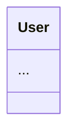
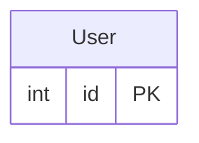

# 🛠️ Backend Helper (`bck-nd-hlpr`)

[](https://pepy.tech/projects/bck-nd-hlpr)
[](https://badge.fury.io/py/bck-nd-hlpr)
[](https://opensource.org/licenses/MIT)

### The Backend Helper: CLI Context & MCP Tooling for AI and Humans

`bck-nd-hlpr` is a lightweight Python CLI utility designed to bridge the gap between back-end codebases, human developers, and AI agents. It acts as a context provider, helping extract structural architecture, generate visual diagrams (such as Mermaid.js charts), and facilitate Model Context Protocol (MCP) interactions.

## Key Features 🌟

- **CLI Context Helper:** Instantly query your backend structure to prepare well-formatted context for LLMs like Claude.
- **Visual Architecture:** Generate clean Mermaid.js architecture diagrams directly from your source code to aid in reverse engineering and documentation.
- **Model Context Protocol (MCP) Support:** Expose backend utilities to AI assistants using Anthropic's open-standard protocol.
- **Developer-Friendly:** Easily installable via PyPI to streamline local development workflows.

## Installation 📦

```bash
pip install bck-nd-hlpr
cd my-backend-project
bck-nd scan . --format mermaid -o architecture.mmd
```

> **Beta:** Esta versión es beta. Soporta los frameworks listados arriba; si tu proyecto tiene estructura no estándar, usa `bck-nd flow` o abre un issue.

---

## ⚡ Key Features

- 🔍 **Auto-Detection**: Identifies Flask, FastAPI, Django, Next.js, Express.js, NestJS, Gin, Actix-web, and more
- 🏭 **Architecture Recognition**: Detects MVC, Microservices, Layered Architecture patterns
- **Smart Diagrams**: Different visualizations for Controllers, Models, Services, Routes
- 🤖 **BYO-Key AI Analysis**: Directly integrate with OpenAI, Anthropic, Gemini, or local Ollama using API keys. No middleware needed!
- 🌐 **Cloud AI Fallback**: Support for 9 AI personalities via n8n webhooks if no keys are provided.
- 🛡️ **Dependency-Free Core**: No PyTorch, No Transformers. Installs in <3 seconds
- 🪟 **OS-Safe Scanning**: Robust directory traversal ignoring `venv`, `node_modules`, and system restricted files
- 🎨 **Visual & Mermaid**: Output Unicode diagrams or copy-paste Mermaid code
- 🚀 **Auto-Documentation (CI/CD)**: One-command setup for GitHub Actions to host living docs on GitHub Pages (`init-ci`)
- 🧠 **AI Context Dump** (`bck-nd prompt`): Export a single, LLM-optimized `.txt` file with project tree + UML + ER + core files — just copy-paste into ChatGPT/Claude for instant codebase understanding **[NEW ✨]**
- 🎓 **Guided Onboarding** (`--teach`): Automatically generates a sequential, tier-ordered learning curriculum of the codebase using dependency-graph heatmaps to quickly ramp up new developers.
- 🛡️ **QA Impact Radius Analysis** (`--impact-radius <file>`): Performs a transitive reverse-dependency traversal to calculate exactly which upstream files and API endpoints might break when a specific file is modified.
- 🔌 **API Contract Map** (`--contract`): Uses advanced static heuristics to match your backend API endpoints with their corresponding ORM database tables and column schemas.
- ❤️ **Project Health Score** (`--health`): Computes a consolidated 0-100 score and letter grade (A-F) evaluating hardcoded secrets, technical debt density (TODOs/FIXMEs), and circular dependency risks.
- 📊 **Jupyter Notebook Lineage** (`--datascience`): Scans and extracts raw data flow/lineage from `.ipynb` files to draw a beautiful Mermaid `graph LR` flowchart of your data pipeline, completely offline and without heavy dependencies (like pandas or nbformat).
- ⚙️ **Flexible Config**: Customize detection via `pyproject.toml`
- 🌍 **Polyglot Ready**: C# (.NET Core), Python (Django/FastAPI), JavaScript/TypeScript (Next.js/Express.js/Drizzle ORM), Java (Spring Boot), PHP (Laravel), Go, Rust, Docker, Terraform, Prisma schemas (`schema.prisma`), and SQL migrations (`.sql`)
- 📄 **Automatic .gitignore Support**: Respects `.gitignore`: automatically excludes files and folders listed in `.gitignore` from scans and context dumps.
- 📱 **Expo/React Native Detection**: Auto-detects Expo and React Native projects for appropriate diagramming.
- ⚙️ **`--max-core-files N` Flag**: Limits the number of core files exported by `bck-nd prompt`.

### 🗄️ ORM Support

| ORM                   | Parser      | Status   |
| --------------------- | ----------- | -------- |
| SQLAlchemy            | tree-sitter | Completo |
| Django ORM            | tree-sitter | Completo |
| Entity Framework Core | tree-sitter | Completo |
| Prisma                | regex       | Completo |
| TypeORM               | regex       | Completo |
| Sequelize             | regex       | Completo |

---

## 📦 Installation

```bash
# From source
cd bck-nd-hlpr
pip install .

# Development mode
pip install -e .

# Verify
bck-nd --help

# Optional: Set your preferred AI Provider key
# set OPENAI_API_KEY=sk-... (Windows)
# export OPENAI_API_KEY=sk-... (Mac/Linux)
```

---

### 🌐 `docs` - Static HTML Portal Generation 🆕

Automatically generates a complete, static HTML documentation portal for your project. Perfect for CI/CD and GitHub Pages.

#### **Usage**

```bash
# Generate docs in the current directory (output folder: 'docs')
bck-nd docs . --output docs
```

**What you get in `docs/index.html`:**

- **Infrastructure Map:** Visual representation of `docker-compose.yml`.
- **API Routes:** Sequence diagrams of HTTP endpoints.
- **UML Class Diagram:** Auto-generated class hierarchy with associations and dependencies.
- **Entity-Relationship:** E-R diagrams for ORM models (Entity Framework, SQLAlchemy, Django).
- **Technical Debt:** Actionable table of TODOs and FIXMEs.
- Fully self-contained, using MermaidJS CDN for rendering. No heavy build tools required.

---

### 🧠 `prompt` - AI Context Dump 🆕

Generates a **single, LLM-optimized `.txt` file** with XML-like tags that you can copy-paste directly into ChatGPT, Claude, or any AI to give it instant, complete understanding of your project.

No more manually explaining your codebase structure — one command, one file, instant AI context.

#### **Usage**

```bash
# Generate ai_context.txt in the current directory
bck-nd prompt .

# Custom output file
bck-nd prompt /my/project -o context.txt

# Deeper scan (default depth is 4)
bck-nd prompt . --depth 6
```

#### **What the file contains**

| XML Tag                | Contents                                          |
| ---------------------- | ------------------------------------------------- |
| `<project_tree>`     | Clean ASCII directory tree (no venv/node_modules) |
| `<architecture_uml>` | UML Class Diagram in Mermaid format               |
| `<architecture_er>`  | Entity-Relationship Diagram in Mermaid format     |
| `<core_files>`       | Content of the 3-5 most important backend files   |

#### **How to use it**

1. Run `bck-nd prompt .` in your project root
2. Open `ai_context.txt`
3. Select All → Copy
4. Paste into ChatGPT / Claude as the first message
5. Start asking questions about your codebase immediately!

#### **Example output structure**

````xml
<!-- bck-nd-hlpr Context Dump -->
<!-- Paste this file into ChatGPT / Claude for instant AI context -->

<project_tree>
my-project/
+-- src/
|   +-- main.py
|   +-- models.py
\-- tests/
</project_tree>

<architecture_uml>


</architecture_uml>

<architecture_er>



</architecture_er>

<core_files>
<file path="src/main.py">

```python
# ... file content ...
```

</file>
</core_files>
````

---

### 🚀 `init-ci` - GitHub Actions Automation 🆕

Set up "Living Documentation" in seconds. This command injects a ready-to-use GitHub Action into your repository.

#### **Usage**

```bash
bck-nd init-ci
```

**What it does:**

- Creates `.github/workflows/bck-nd-docs.yml`.
- Configures an automatic trigger on `push` to the `main` branch.
- Installs `bck-nd-hlpr` in the CI runner.
- Generates the full HTML portal (UML, ER, Infra, Routes).
- Deploys the result automatically to **GitHub Pages**.

---

### 🕵️ `scan` - Automatic Architecture Detection

Automatically scans your project, detects the framework and architecture, and generates intelligent diagrams.

#### **Basic Usage**

```bash
# Scan current directory (default depth: 3)
bck-nd scan .

# Scan specific directory
bck-nd scan src

# Custom depth
bck-nd scan . --depth 5
```

#### **Modes**

##### 1. **Full Architecture Overview (Default)**

```bash
bck-nd scan .
```

**Output:**

- Framework detection (Flask, FastAPI, Django, etc.)
- Architecture type (MVC, Microservices, etc.)
- Features (Docker, Auth, Database, etc.)
- **Infra Map:** Docker Compose services
- **API Routes:** Endpoints sequence diagram
- **UML & ER:** Class and Entity-Relationship Mermaid diagrams
- **TODOs:** Technical Debt Report

##### 2. **Mermaid Export (New!)**

```bash
bck-nd scan . --format mermaid
```

**Output:**

- Generates `graph TD` code ready to copy-paste into Notion, GitHub, or Obsidian.
- **Also shows** the specific visual diagram in the terminal for instant preview.
- Perfect for documentation and presentations.

##### 3. **UML Class Diagram**

```bash
bck-nd scan . --uml
```

- Generates `classDiagram` code for Mermaid.js.
- Uses a unified multi-language parser combining AST (Python) and Tree-Sitter (C#, Java, JS/TS, PHP) to extract classes, methods, properties, and constructors automatically.
- Automatically infers relationships (`-->` Associations, `..>` Dependencies) and inheritance (`<|--`) across all files.

##### 3. **Diagram + Local Report**

```bash
bck-nd scan . --explain
```

**Output:**

- Everything from mode 1, PLUS
- Text-based component breakdown
- List of Controllers, Models, Services
- No AI required (100% offline)

##### 5. **Entity-Relationship Diagram (ER) 🆕**

```bash
bck-nd scan . --er
```

**Output:**

- Generates `erDiagram` for Mermaid.js.
- Scans modern schema configurations, migrations, and ORMs across languages:
  - **Modern Configs**: Prisma Schemas (`schema.prisma`), Drizzle ORM schemas (`.ts/.js`), and raw SQL migrations (`.sql`)
  - **Traditional ORMs**: Entity Framework (C#), Spring Boot / JPA (Java), Laravel / Eloquent (PHP), SQLAlchemy / Django models (Python), and Sequelize / Mongoose (JS/TS)
- Bulletproof Mermaid Syntax: Safely handles Generics (e.g. `List<T>`), table brackets, and special characters.
- Detects database columns, primary keys (`PK`), data annotations, and auto-generates bidirectional relationships (`||--o{`, `}o--||`) with intelligent schema deduplication and merging.

| ORM        | Nivel                  |
| ---------- | ---------------------- |
| SQLAlchemy | tree-sitter (completo) |
| Django     | tree-sitter (completo) |
| EF Core    | tree-sitter (completo) |
| Prisma     | regex (maqueta)        |
| TypeORM    | regex (maqueta)        |
| Sequelize  | regex (maqueta)        |

##### 6. **API Route Map 🆕**

```bash
bck-nd scan . --routes
```

**Output:**

- Generates `sequenceDiagram` for Mermaid.js.
- Scans `Flask` and `FastAPI` endpoints.
- Visualizes `Client -> API` interactions with methods and paths.

##### 7. **Infrastructure Diagram 🆕**

```bash
bck-nd scan . --infra
```

**Output:**

- Generates `graph LR` for Mermaid.js.
- Scans `docker-compose.yml` files.
- Shows services, images, and dependencies.
- Database services (postgres, redis, mysql, mongo) displayed as cylinders.

##### 8. **Technical Debt Scanner 🆕**

```bash
bck-nd scan . --todo
```

**Output:**

- Scans for TODO, FIXME, HACK, XXX, BUG comments
- Beautiful color-coded table using Rich
- Shows file, line number, type, and message
- Statistics by debt type
- Debt level assessment
- Perfect for code reviews and sprint planning

##### 9. **Security Audit 🆕**

```bash
bck-nd scan . --audit
```

**Output:**

- Scans for hardcoded secrets, keys, and dangerous config
- Reports "Critical" risks like AWS Keys or Private PEMs
- Reports "High/Warning" risks like DB passwords or hardcoded IPs
- Essential for pre-commit checks

##### 10. **Dependency Heatmap 🆕**

```bash
bck-nd scan . --impact
```

**Output:**

- Shows a "Heatmap" of your files based on how many other files import them.
- Helps identify "Core" modules that are risky to refactor.
- Sorts by Impact Score and assigns Risk Categories (`🔥 CORE`, `🟡 SHARED`, `🟢 PERIPHERAL`).

##### 10.5 **Route-to-DB Traceability 🆕**

```bash
bck-nd scan . --trace
```

**Output:**

- Generates `graph LR` for Mermaid.js.
- Traces API calls starting from your routes down to your services and models.
- Parses AST (currently supports Python: FastAPI/Flask).

##### 10.6 **Guided Onboarding** [NEW 🎓]

```bash
bck-nd scan . --teach
```

**Output:**

- Evaluates file relationships to calculate reading hierarchy.
- Outputs a color-coded sequential table dividing the codebase into Entrypoints, Core Logic, and Infra/Database files.

##### 10.7 **Data Science Lineage Map** [NEW 📊]

```bash
bck-nd scan . --datascience
```

**Output:**

- Parses `.ipynb` JSON nodes and analyzes cells.
- Generates a Mermaid `graph LR` lineage flowchart mapping input files, notebooks, and outputs/models.

##### 10.8 **QA Impact Radius** [NEW 🛡️]

```bash
bck-nd scan . --impact-radius src/bck_nd_hlpr/route_parser.py
```

**Output:**

- Traverses reverse-dependencies transitively using BFS.
- Outputs a clean report showing the complete affected file chain and a list of impacted API endpoints.

##### 10.9 **API Contract Map** [NEW 🔌]

```bash
bck-nd scan . --contract
```

**Output:**

- Matches backend API routes with ORM models using path-matching, handler-naming, and import-based heuristics.
- Renders a structured terminal table displaying endpoints, matched database tables, and their column schemas.

##### 10.10 **Project Health Score** [NEW ❤️]

```bash
bck-nd scan . --health
```

**Output:**

- Calculates a consolidated 0-100 quality score.
- Renders a beautifully styled Rich report card featuring letter grades (A-F) and details of security/debt point deductions.

##### 11. **Diagram + AI Analysis**

```bash
bck-nd scan . --ai
```

**Output:**

- Everything from mode 1, PLUS
- AI-powered architectural analysis
- Design pattern recommendations
- Code quality insights
- Detects API keys in your environment (OpenAI, Anthropic, Gemini, Ollama) or falls back to Webhook (n8n).

##### 11. **Force Specific AI Provider 🆕**

```bash
bck-nd scan . --ai --provider openai
```

**Output:**

- Supported providers: `openai`, `anthropic`, `gemini`, `ollama`, `webhook`.
- Safely reports an error if the corresponding API key is missing.

##### 12. **AI Only (No Diagram)**

```bash
bck-nd scan . --no-graph --ai
```

**Output:**

- Only AI analysis (no Mermaid diagram)
- Faster for text-only reports

##### 13. **Project File/Directory Tree [NEW]**

```bash
bck-nd scan . --tree
```

**Output:**

- Generates a clean ASCII directory tree of the project using Unicode box-drawing characters.
- Automatically and silently filters out ignored directories (such as `node_modules`, `venv`, `.git`, etc.) based on `GLOBAL_IGNORE_DIRS`.

#### **AI Personalities**

```bash
# Professional analysis
bck-nd scan . --ai --style pro

# Security-focused review
bck-nd scan . --ai --style hacker

# Critical code review (like Gordon Ramsay)
bck-nd scan . --ai --style ramsay

# Simple explanations
bck-nd scan . --ai --style eli5

# Available styles (Mostly optimized for the Webhook / n8n Mode):
# pro, hacker, soviet, eli5, ramsay, jarvis, corporate, medieval, doom
```

---

### 📐 `flow` - Manual Diagram Generation

Create custom architecture diagrams from string descriptions.

#### **Usage**

```bash
bck-nd flow "Client -> API -> Database"

bck-nd flow "Client -> LoadBalancer -> [API_v1, API_v2] ; API_v1 -> Redis"

bck-nd flow "User -> Auth [Service] -> JWT [Token] -> API"
```

#### **Syntax**

- `A -> B` - Creates connection from A to B
- `[X, Y, Z]` - Multiple nodes in same position
- `;` - New row
- `[DB]`, `[SQL]`, `[DATA]` - Rendered as database cylinders
- `[Service]`, `[DIR]` - Rendered as soft boxes
- `[?]`, `[IF]` - Rendered as diamonds

---

## 📚 Command Manual

### 🖥️ `explore` - Interactive TUI Mode (Explorer) 🆕

Launch a full-screen Terminal User Interface (TUI) to interactively explore your project's architecture, powered by `textual`.

#### **Usage**

```bash
bck-nd explore
```

**What you get:**

- **Sidebar:** Directory tree to navigate your codebase.
- **Main View:** Click on a `.py` file to instantly generate its ASCII diagram and Mermaid Sequence routes.
- **Dynamic Analysis:** Click on a folder to see the high-level architecture of that specific directory.
- **Shortcuts:** Press `D` to toggle dark/light mode, `Q` to quit.

---

## 🎯 Usage Examples

### Example 1: Quick Project Analysis

```bash
cd my-backend-project
bck-nd scan .
```

**What you get:**

```
🔍 Analizando arquitectura de '.'...
💻 Framework detectado: FastAPI
🏭 Arquitectura: REST API (Route-based)
✨ Características: Docker, SQLAlchemy ORM, Authentication

📝 FastAPI application using REST API (Route-based) with Docker, SQLAlchemy ORM, Authentication.

📊 DIAGRAMA DE ARQUITECTURA:
[ASCII diagram showing Routes -> Services -> Models -> Database]
```

### Example 2: Deep Analysis with AI

```bash
bck-nd scan . --ai --style pro --depth 5
```

**What you get:**

- Complete architecture detection
- Full project diagram
- AI analysis including:
  - Design pattern recommendations
  - Security considerations
  - Performance optimization suggestions
  - Code quality assessment

### Example 3: Text-Only Report

```bash
bck-nd scan src --explain --no-graph
```

**What you get:**

- Framework/architecture detection
- Component list without diagram
- Perfect for CI/CD logs

### Example 4: Compare Two Approaches

```bash
# Old monolith
bck-nd scan ./legacy --ai --style ramsay

# New microservices
bck-nd scan ./new-arch --ai --style pro
```

---

## 🔧 Architecture Detection

Backend Helper automatically detects:

### **Frameworks**

| Language              | Frameworks                                                                                                       |
| --------------------- | ---------------------------------------------------------------------------------------------------------------- |
| Python                | Flask, FastAPI, Django (Specialized ER/UML), Quart                                                               |
| JavaScript/TypeScript | Next.js (Filesystem Routes & React UML), Express.js (Specialized ER/UML), Fastify, Koa, NestJS (Route Detection) |
| Java                  | Spring Boot (Specialized ER/UML), Maven, Gradle                                                                  |
| PHP                   | Laravel (Specialized ER/UML)                                                                                     |
| C# / .NET             | .NET Core, Entity Framework (Specialized ER/UML)                                                                 |
| Go                    | Gin, Fiber                                                                                                       |
| Rust                  | Actix-web, Rocket                                                                                                |

### **Architecture Patterns**

- **Microservices Architecture** - Multiple services in docker-compose
- **MVC + Services (Layered)** - Controllers, Models, Services folders
- **MVC Pattern** - Controllers + Models
- **REST API (Route-based)** - Routes + Models
- **Containerized Application** - Docker detected
- **Monolithic Application** - Fallback

### **Features Detection**

- Docker / Docker Compose
- Databases (SQL, SQLite)
- ORM (SQLAlchemy, Django ORM)
- Authentication (JWT, OAuth)
- API Documentation (Swagger/OpenAPI)
- CI/CD (GitHub Actions, GitLab CI)
- Unit Tests
- **Security**: Auto-redaction of secrets in output (Sanitizer) 🆕

### **Configuration**

You can override architecture detection by adding this to `pyproject.toml`:

```toml
[tool.bck-nd]
controllers = ["handlers", "views"]
models = ["entities", "schemas"]
services = ["logic", "usecases"]
```

---

## 💾 Output Persistence (New!)

You can now save any report or diagram to a file using `-o` / `--output`.
The tool automatically **strips ANSI color codes** for clean text files.

```bash
# Save ASCII diagram
bck-nd scan . -o architecture.txt

# Save Technical Debt Report (Clean text)
bck-nd scan . --todo -o report.txt

# Save Mermaid diagram
bck-nd scan . --er --format mermaid -o db.mmd
```

---

## 🧪 AI Providers Setup (BYO-Key)

Backend Helper automatically loads `.env` files if they exist in your project root.

> **⚠️ Security Warning:** Never commit `.env` to public repositories; `init-ci` does not inject keys into the repo.

Preferred order (checked automatically):

```text
# Preferred order (checked automatically)
OPENAI_API_KEY=sk-...
ANTHROPIC_API_KEY=sk-ant-...
GOOGLE_API_KEY=AIzaSy...
OLLAMA_HOST=http://localhost:11434
BCK_ND_WEBHOOK_URL=https://your-server.com/webhook/explain
```

Then run:

```bash
bck-nd scan . --ai
```

### Option 3: Ollama (Local AI)

No API key required. Make sure Ollama is running on `http://localhost:11434`.

```bash
# Optionally customize the host
export OLLAMA_HOST="http://localhost:11434"
bck-nd scan . --ai --provider ollama
```

### Option 5: n8n Webhook Fallback

If no keys are found, it falls back to the legacy webhook approach.

#### 1. Install n8n

```bash
npm install -g n8n
```

##### 2. Start n8n

```bash
n8n start
```

Access: `http://localhost:5678`

##### 3. Create Workflow

1. Add **Webhook** trigger
   - Method: `POST`
   - Path: `explain`
2. Add **AI** node (OpenAI/Gemini)
   - System: `{{ $json.prompt }}`
   - Input: `{{ $json.text }}`
3. Add **Respond to Webhook**
   - JSON: `{ "text": "{{ $json.output }}" }`
4. Activate workflow

##### 4. Custom Webhook (Optional)

```bash
# Windows
set BCK_ND_WEBHOOK_URL=https://your-server.com/webhook/explain

# Linux/Mac
export BCK_ND_WEBHOOK_URL=https://your-server.com/webhook/explain
```

---

## 🤖 MCP Integration (Claude Desktop / Cursor)

Backend Helper includes a server compatible with the **Model Context Protocol (MCP)**, providing 16 powerful architecture tools directly to your AI assistants, including our 5 newly supported AI co-pilot tools:

- `get_project_health` (Calculates and displays the project health scorecard)
- `get_guided_onboarding` (Retrieves the step-by-step reading sequence for new devs)
- `export_data_dictionary` (Outputs schema schemas in JSON/CSV formats)
- `get_impact_radius` (Maps file modifications transitively to affected API routes)
- `get_api_contract_map` (Bridges API routes directly to database columns)

For full configuration instructions for Claude Desktop and Cursor, see [ADVANCED.md](ADVANCED.md).

---

## Comparison: Different Commands

| Command                           | Architecture Detection | Diagram        | Text Report         | AI Analysis      | AI Context File |
| --------------------------------- | ---------------------- | -------------- | ------------------- | ---------------- | --------------- |
| `bck-nd scan .`                 | ✅                     | ✅ (Full Arch) | ❌                  | ❌               | ❌              |
| `bck-nd scan . --explain`       | ✅                     | ✅             | ✅                  | ❌               | ❌              |
| `bck-nd scan . --teach`         | ✅                     | ❌             | ✅ (Onboarding)     | ❌               | ❌              |
| `bck-nd scan . --datascience`   | ✅                     | ✅ (Data Line) | ❌                  | ❌               | ❌              |
| `bck-nd scan . --ai`            | ✅                     | ✅             | ❌                  | ✅               | ❌              |
| `bck-nd scan . --explain --ai`  | ✅                     | ✅             | ✅                  | ✅               | ❌              |
| `bck-nd scan . --no-graph --ai` | ✅                     | ❌             | ❌                  | ✅               | ❌              |
| `bck-nd scan . --uml`           | ✅                     | ✅ (UML Class) | ❌                  | ❌               | ❌              |
| `bck-nd scan . --er`            | ✅                     | ✅ (ER DB)     | ❌                  | ❌               | ❌              |
| `bck-nd scan . --routes`        | ✅                     | ✅ (API Seq)   | ❌                  | ❌               | ❌              |
| `bck-nd scan . --infra`         | ✅                     | ✅ (Docker LR) | ❌                  | ❌               | ❌              |
| `bck-nd scan . --todo`          | ✅                     | ❌             | ✅ (Debt)           | ❌               | ❌              |
| `bck-nd scan . --audit`         | ✅                     | ❌             | ✅ (Sec. Risks)     | ❌               | ❌              |
| `bck-nd scan . --impact`        | ✅                     | ❌             | ✅ (Impact Heatmap) | ❌               | ❌              |
| `bck-nd scan . --impact-radius` | ✅                     | ❌             | ✅ (Impact Chain)   | ❌               | ❌              |
| `bck-nd scan . --contract`      | ✅                     | ✅ (Contract)  | ❌                  | ❌               | ❌              |
| `bck-nd scan . --health`        | ✅                     | ❌             | ✅ (Health Grade)   | ❌               | ❌              |
| `bck-nd scan . --trace`         | ✅                     | ✅ (Trace LR)  | ❌                  | ❌               | ❌              |
| `bck-nd scan . --tree`          | ✅                     | ✅ (File Tree) | ❌                  | ❌               | ❌              |
| `bck-nd prompt .`               | ✅                     | ✅ (Mermaid)   | ❌                  | ❌               | ✅ (XML)        |
| `bck-nd flow "A -> B"`          | ❌                     | ✅             | ❌                  | ❌               | ❌              |
| `bck-nd explore`                | ✅                     | ✅             | ✅                  | ❌               | ❌              |
| `bck-nd docs .`                 | ✅                     | ✅ (All HTML)  | ✅ (HTML Portal)    | ❌               | ❌              |
| `bck-nd chat .`                 | ✅                     | ✅ (Loaded)    | ❌                  | ✅ (Interactive) | ❌              |
| `bck-nd init-ci`                | ✅                     | ✅             | ✅                  | ❌               | ❌              |

---

## 🎭 AI Personalities Guide

> **Note:** Only used in webhook mode; provider-specific styles may vary.

| Style         | Description                                   | Use Case                 |
| ------------- | --------------------------------------------- | ------------------------ |
| `pro`       | Senior Software Architect - Technical, formal | Production documentation |
| `hacker`    | Security Expert - Focuses on vulnerabilities  | Security audits          |
| `soviet`    | Soviet Engineer - Efficiency-focused          | Performance reviews      |
| `eli5`      | Kindergarten Teacher - Simple explanations    | Onboarding juniors       |
| `ramsay`    | Gordon Ramsay - Brutally critical             | Code reviews             |
| `jarvis`    | Tony Stark's AI - Elegant, helpful            | Executive presentations  |
| `corporate` | Manager - Buzzword-heavy                      | Stakeholder reports      |
| `medieval`  | Ancient Wizard - Metaphorical                 | Creative documentation   |
| `doom`      | Doom Slayer - Bugs are demons                 | Bug hunting              |

---

## 🐛 Troubleshooting

### "No se encontraron archivos"

**Solution:**

```bash
# Increase depth
bck-nd scan . --depth 5

# Or scan specific directory
bck-nd scan src --depth 3
```

### "Error conexión: ..."

**Cause:** n8n not running
**Solution:**

```bash
# Terminal 1
n8n start

# Terminal 2
bck-nd scan . --ai
```

### "Framework detectado: Unknown"

**Cause:** Framework not yet supported or non-standard structure
**Solution:** Use `bck-nd flow` for manual diagrams

---

## 📊 Supported File Types

| Type           | Detection Method                              | Output Shape               |
| -------------- | --------------------------------------------- | -------------------------- |
| Controllers    | `*controller.py`, `*ctrl.py`              | Box → API                 |
| Models         | `*model.py`, `*entity.py`, `*schema.py` | Box → Database (Cylinder) |
| Services       | `*service.py`, `*svc.py`                  | Box → Business Logic      |
| Routes         | `*route.py`, `*router.py`                 | Box → Endpoints           |
| Middleware     | `*middleware.py`                            | Box → Request Pipeline    |
| Database Files | `.sql`, `.db`, `.sqlite`                | Cylinder → Data Storage   |
| Docker         | `Dockerfile`, `docker-compose.yml`        | Soft Box                   |
| ORM            | SQLAlchemy, Django, Prisma, etc.              | Cylinder → DB Access      |
| Infrastructure | `.tf` (Terraform)                           | Box → Infrastructure      |

---

## 🧬 How it Started

bck-nd-hlpr evolved from an earlier experiment (ASCII Architect) that used GPT-2 to generate ASCII diagrams. It worked, but required ~2GB of dependencies just to draw a diamond. This project rebuilds the same idea from scratch: deterministic renderers, no model downloads, installs in under 3 seconds.

---

## 📝 Real-World Usage

### CI/CD Integration

#### **Option A: Automatic Setup (Recommended)**

```bash
# Run this once locally to inject the workflow
bck-nd init-ci
git add . && git commit -m "ci: add auto-documentation" && git push origin main
```

#### **Option B: Manual YAML**

```yaml
# .github/workflows/arch-analysis.yml
- name: Analyze Architecture
  run: |
    pip install bck-nd-hlpr
    bck-nd scan . --explain --no-graph > architecture.txt
```

### Code Review Automation

```bash
# Before PR approval
bck-nd scan . --ai --style pro > review.md
```

### Documentation Generation

```bash
# Generate architecture docs

bck-nd scan . --explain > docs/ARCHITECTURE.md
bck-nd scan . --ai --style pro > docs/AI_ANALYSIS.md
```

---

## 📚 Documentation

- [IA-context.md](IA-context.md) - Development rules & architecture
- [ROADMAP.txt](ROADMAP.txt) - Feature roadmap
- [MANIFEST.in](MANIFEST.in) - Package configuration

---

## 💡 Philosophy

> **"Less guessing, more coding."**

Backend Helper is designed for **speed**, **intelligence**, and **actionable insights**. No bloated dependencies, no waiting for model downloads. Just instant architectural understanding.

---

## 🤝 Contributing

Issues and PRs welcome! See [IA-context.md](IA-context.md) for development guidelines.

---

## 📄 License

MIT License - See LICENSE file for details

---

**Built with ❤️ for developers who value clarity and speed.**
